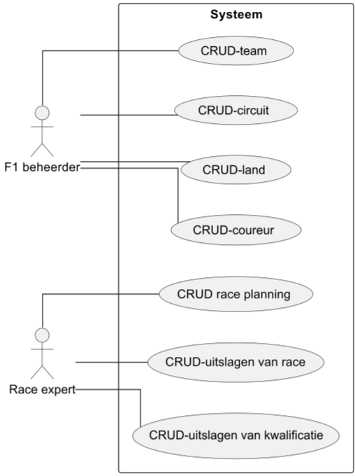
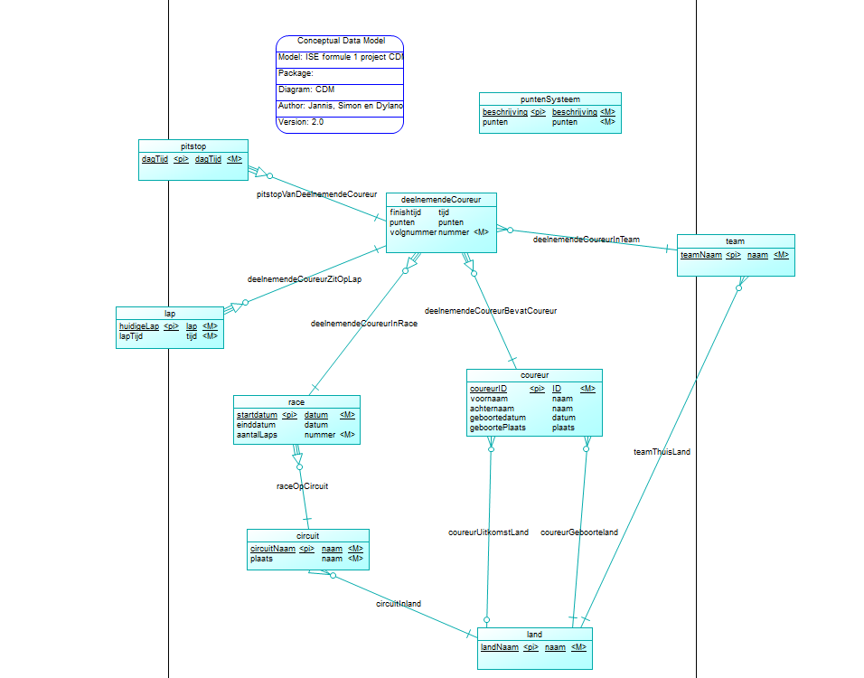
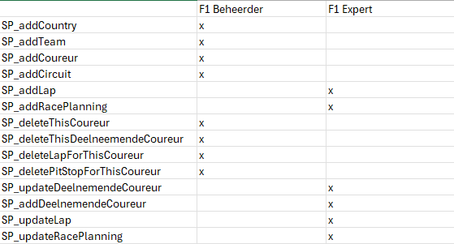

Functioneel Ontwerp

## 1 Inleiding
In dit bestand wordt het functioneel ontwerp van het formule 1 geschreven. Hierbij zal worden gekeken naar de functionele en non-functionele eisen die van belang zijn bij dit project. Tijdens het project worden er usecases opgesteld die gerealiseerd moeten worden. Wanneer er aan een usecase word gewerkt word deze fullydressed uitgewerkt. 

Verder wordt er in dit document verwoordingen ontleed en geanalyseerd, met deze onledingen word een CDM gemaakt. Dit CDM word in dit document beschreven. 

## 2 Functionele eisen
### functioneel
- Het systeem moet data van planning van races kunnen aanbieden.
- Het systeem moet data van coureurs kunnen aanbieden.
- Het systeem moet data van uitslagen van races kunnen aanbieden.
- Het systeem moet data van pitstops (tijdens de race) kunnen aanbieden.
- Het systeem moet data van resultaten van kwalificatieraces kunnen aanbieden.
- Het systeem moet opslaan wie een verzoek voor een JSON aanvraagt. 
- Het systeem moet data in JSON-formaat aanbieden.
- De database waar alle formule 1 data wordt in opgeslagen moet een relationele database zijn.
- De database waar alle JSON in worden opgeslagen moet een non-relationele database zijn.
- Klanten mogen geen contact hebben met de database waarin alle formule 1 data direct is in opgeslagen.

## 3 Fully dressed

### Use cases diagrams
In het plaatje hieronder staat een UML diagram van de use cases die in het formule 1 systeem zitten. Deze acties zullen door het systeem moeten kunnen worden uitgevoerd.

Hieronder heb je de fully dressed use cases.
Omdat de fully dressed use cases allemaal CRUD zijn hebben wij er, maar twee uitgewerkt aangezien de rest in principe hetzelfde is met een paar kleine aanpassingen
### Use case: CRUD-coureur
<table>
    <tr>
        <td colspan="2">
            <b>Primary actor: </b>
            F1 beheerder
        </td>
    </tr>
    <tr>
        <td colspan="2">
            <b>Stakeholders and Interests: </b>
            Als F1 beheerder wil ik de coureurs kunnen toevoegen, bijwerken en verwijderen, zodat ik de datbase kan onderhouden.
        </td>
    </tr>
    <tr>
        <td colspan="2">
            <b>Requirements: </b>
            <ul>
                <li>De F1 beheerder is ingelogd in de F1beheerder rol.</li>
            </ul>
        </td>
    </tr>
    <tr>
        <td colspan="2">
            <b>Brief description: </b>
            
De F1 beheerder kan data toevoegen, bijwerken of verwijderen.
               Dit doet die door de bijbehorende procedure aan te roepen. 

        </td>
    </tr>
    <tr>
        <td colspan="2">
            <b>Preconditions: </b>
            
De mongoDB staat online en kan verzoeken ontvangen. 
                Er is een land in de land tabel. 
                De API kan data versturen en ontvangen.
            

        </td>
    </tr>
    <tr>
        <td colspan="2">
            <b>Postconditions: </b>
            
De mongoDB is geupdate.

        </td>
    </tr>
    <tr>
        <td colspan="2">
            <b>Main Success Scenario (Basic Flow): </b>
        </td>
    </tr>
    <tr>
        <td>
            <b>Actor Action</b>
        </td>
        <td>
            <b>System Responsibility</b>
        </td>
    </tr>
    <tr>
        <td>
            <b>1.</b>De F1 beheerder expert execute de addCoureur stored procedure.
        </td>
        <td>
        </td>
    </tr>
    <tr>
        <td>
        </td>
        <td>
            <b>2.</b> Voegt de coureur data toe aan de relationele database.
        </td>
    </tr>
    <tr>
        <td>
        </td>
    </tr>
    <tr>
        <td colspan="2">
            <b>Extensions (Alternative Flows): </b> update coureur data.
        </td>
    </tr>
    <tr>
        <td>
            <b>Actor Action</b>
        </td>
        <td>
            <b>System Responsibility</b>
        </td>
    </tr>
    <tr>
        <td>
            <b>1b. </b> De F1 beheerder expert execute de updateCoureur stored procedure.
        </td>
        <td>            
        </td>
    </tr>
    <tr>
        <td>
        </td>
        <td>
            <b>2b. </b> Update de coureur data in de relationele database.
        </td>
    </tr>
<tr>
        <td colspan="2">
            <b>Extensions (Alternative Flows): </b> delete coureur data.
        </td>
    </tr>
    <tr>
        <td>
            <b>Actor Action</b>
        </td>
        <td>
            <b>System Responsibility</b>
        </td>
    </tr>
    <tr>
        <td>
            <b>1c. </b> De F1 beheerder expert execute de deleteCoureur stored procedure.
        </td>
        <td>            
        </td>
    </tr>
    <tr>
        <td>
        </td>
        <td>
            <b>2b. </b> delete de coureur data in de relationele database.
        </td>
    </tr>
</table>

### Use case: CRUD race planning
<table>
    <tr>
        <td colspan="2">
            <b>Primary actor: </b>
            Race expert
        </td>
    </tr>
    <tr>
        <td colspan="2">
            <b>Stakeholders and Interests: </b>
            Als Race expert wil ik de coureurs kunnen toevoegen, bijwerken en verwijderen, zodat ik de database kan onderhouden.
        </td>
    </tr>
    <tr>
        <td colspan="2">
            <b>Requirements: </b>
            <ul>
                <li>De Race expert is ingelogd in de RaceExpert rol.</li>
                <li>De bijbehorende Race expert is ingelogd in de RaceExpert rol.</li>
            </ul>
        </td>
    </tr>
    <tr>
        <td colspan="2">
            <b>Brief description: </b>
            
De F1 beheerder kan data toevoegen, bijwerken of verwijderen.
               Dit doet die door de bijbehorende procedure aan te roepen. 

        </td>
    </tr>
    <tr>
        <td colspan="2">
            <b>Preconditions: </b>
            
De mongoDB staat online en kan verzoeken ontvangen. 
                Er zit data in de land tabel.  
                Er zit data in de circuit tabel.  
                De API kan data versturen en ontvangen.
            

        </td>
    </tr>
    <tr>
        <td colspan="2">
            <b>Postconditions: </b>
            
De mongoDB is geupdate.

        </td>
    </tr>
    <tr>
        <td colspan="2">
            <b>Main Success Scenario (Basic Flow): </b>
        </td>
    </tr>
    <tr>
        <td>
            <b>Actor Action</b>
        </td>
        <td>
            <b>System Responsibility</b>
        </td>
    </tr>
    <tr>
        <td>
            <b>1.</b>De Race expert execute de SP_addRacePlanning stored procedure.
        </td>
        <td>
        </td>
    </tr>
    <tr>
        <td>
        </td>
        <td>
            <b>2.</b> De procedure voegt de race planning data toe aan de relationele database.
        </td>
    </tr>
    <tr>
        <td>
        </td>
        <td>
           <b>3.</b> Stopt de stored procedure addCoureur in de tabel executieSchema.
        </td>
    </tr>
    <tr>
    <tr>
        <td>
        </td>
        <td>
            <b>4.</b> Job runt de stored procedure en stuurt de gemaakte JSON door naar de API.
        </td>
    </tr>
    <tr>
        <td>
        </td>
        <td>
            <b>5.</b> API stuurt de JSON door naar de MongoDB.
        </td>
    </tr>
    <tr>
        <td>
        </td>
        <td>
            <b>6.</b> De mongoDB voegt de nieuwe race planning toe.
        </td>
    </tr>
</table>

## 4 Entity relationship diagram (erd)
### 4.1 Feittypes
#### 4.1.1 ontleden feittypes
#### Bijlage D
<table>
    <tr>
        <td>Feitnummer</td>
        <td>Zin</td>
    </tr>
  <tr>
        <td>1</td>
        <td>
            De coureur op de eerste plaats in de grand prix krijgt 15 punten.  
            <i style="color: yellow"> De coureur op de tweede plaats in de grand prix </i> krijgt <i style="color: chartreuse"> 10 punten</i>.  
            ET: puntenSysteem &nbsp;&nbsp;&nbsp;&nbsp;&nbsp;&nbsp;&nbsp;&nbsp;&nbsp;&nbsp;&nbsp;&nbsp;&nbsp;&nbsp;&nbsp;&nbsp;&nbsp;&nbsp;&nbsp;&nbsp;&nbsp;&nbsp; Att: punten  
            ID: Att: beschrijving  
            Predicaat: &lt;beschrijving&gt; krijgt &lt;punten&gt;.
        </td>
    </tr>
    <tr>
        <td>2</td>
        <td>
            Coureur met id 2 heeft als achternaam Hamilton.  
            <i style="color: yellow">Coureur met id 1</i> heeft als <i style="color: chartreuse">achternaam Verstappen</i>. 
            ET: coureur &nbsp;&nbsp;&nbsp;&nbsp;&nbsp;&nbsp;&nbsp;&nbsp;&nbsp;&nbsp;&nbsp;&nbsp;&nbsp;&nbsp;&nbsp;&nbsp;&nbsp;&nbsp;&nbsp;&nbsp;&nbsp;&nbsp;&nbsp;&nbsp;&nbsp;&nbsp;&nbsp;&nbsp;&nbsp;&nbsp;&nbsp;&nbsp;&nbsp;&nbsp;&nbsp;&nbsp; Att: achternaam  
            ID: Att: coureurID  
            Predicaat: Coureur me id &lt;coureurID&gt; heeft als achternaam &lt;achternaam&gt;.
        </td>
    </tr>
    <tr>
        <td>3</td>
        <td>
            Coureur met id 2 heeft als voornaam Lewis.  
            <i style="color: yellow"> Coureur met id 1</i> heeft als <i style="color: chartreuse">voornaam Max</i>. 
            ET: coureur &nbsp;&nbsp;&nbsp;&nbsp;&nbsp;&nbsp;&nbsp;&nbsp;&nbsp;&nbsp;&nbsp;&nbsp;&nbsp;&nbsp;&nbsp;&nbsp;&nbsp;&nbsp;&nbsp;&nbsp;&nbsp;&nbsp;&nbsp;&nbsp;&nbsp;&nbsp;&nbsp;&nbsp;&nbsp;&nbsp;&nbsp;&nbsp;&nbsp;&nbsp;&nbsp;&nbsp; Att: voornaam  
            ID: MATCH   
            Predicaat: Coureur me id &lt;coureurID&gt; heeft als voornaam &lt;voornaam&gt;.
        </td>
    </tr>
    <tr>
        <td>4</td>
        <td>
            De circuit Yas marinas ligt in de plaats Yas Island.  
            De <i style="color: yellow">circuit Zandvoort </i> ligt in de <i style="color: chartreuse"> plaats Zandvoort </i>.  
            De <i style="color: yellow">circuit Zandvoort </i> ligt in de <i style="color: chartreuse"> plaats Zandvoort </i>.  
            ET: circuit &nbsp;&nbsp;&nbsp;&nbsp;&nbsp;&nbsp;&nbsp;&nbsp;&nbsp;&nbsp;&nbsp;&nbsp;&nbsp;&nbsp;&nbsp;&nbsp;&nbsp;&nbsp;&nbsp;&nbsp;&nbsp;&nbsp;&nbsp;&nbsp;&nbsp;&nbsp;&nbsp;&nbsp;&nbsp;&nbsp;&nbsp;&nbsp;&nbsp;&nbsp;&nbsp;&nbsp; Att: plaats  
            ID: att: circuitNaam  
            Predicaat: De circuit &lt;circuitNaam&gt; ligt in de plaats &lt;plaats&gt;.  
        </td>
    </tr>
    <tr>
        <td>5</td>
        <td>
            De circuit Yas marinas ligt in het land Abu Dhabi.  
            De <i style="color: yellow">circuit Zandvoort </i> ligt in het <i style="color: chartreuse"> land Nederland </i>.  
            De <i style="color: yellow">circuit Zandvoort </i> ligt in het <i style="color: chartreuse"> land Nederland </i>.  
            ET: circuit &nbsp;&nbsp;&nbsp;&nbsp;&nbsp;&nbsp;&nbsp;&nbsp;&nbsp;&nbsp;&nbsp;&nbsp;&nbsp;&nbsp;&nbsp;&nbsp;&nbsp;&nbsp;&nbsp;&nbsp;&nbsp;&nbsp;&nbsp;&nbsp;&nbsp;&nbsp;&nbsp;&nbsp;&nbsp;&nbsp;&nbsp;&nbsp;&nbsp;&nbsp;&nbsp;&nbsp; ET: land  
            ID: MATCH &nbsp;&nbsp;&nbsp;&nbsp;&nbsp;&nbsp;&nbsp;&nbsp;&nbsp;&nbsp;&nbsp;&nbsp;&nbsp;&nbsp;&nbsp;&nbsp;&nbsp;&nbsp;&nbsp;&nbsp;&nbsp;&nbsp;&nbsp;&nbsp;&nbsp;&nbsp;&nbsp;&nbsp;&nbsp;&nbsp;&nbsp;&nbsp;&nbsp; ID: att: landNaam 
            RT: circuitInLand tussen circuit en land.  
            Predicaat: De circuit &lt;circuitNaam&gt; ligt in de land &lt;landNaam&gt;.  
        </td>
    </tr>
    <tr>
        <td>6</td>
        <td>
            De grand prix op circuit Zandvoort van 2021-01-01 is geëindigd op 15 jan 2021.  
            De grand prix op<i style="color: yellow"> circuit Zandvoort van 2022-01-01</i> is geëindigd op <i style="color: chartreuse"> 12 dec 2022. </i>  
            ET: race &nbsp;&nbsp;&nbsp;&nbsp;&nbsp;&nbsp;&nbsp;&nbsp;&nbsp;&nbsp;&nbsp;&nbsp;&nbsp;&nbsp;&nbsp;&nbsp;&nbsp;&nbsp;&nbsp;&nbsp;&nbsp;&nbsp;&nbsp;&nbsp;&nbsp;&nbsp;&nbsp;&nbsp;&nbsp;&nbsp;&nbsp;&nbsp;&nbsp;&nbsp;&nbsp;&nbsp; Att: einddatum  
            ID: ET: circuit + Att: startdatum  
            RT: raceOpCircuit tussen race(dependent) en circuit.  
            Predicaat: De grand prix op &lt;circuitNaam&gt; van &lt;startdatum&gt; is geëindigd op &lt;eindatum&gt;.  
        </td>
    </tr>
    <tr>
        <td>7</td>
        <td>
            De grand prix op circuit Zandvoort van 2021-01-01 heeft een totaal aantal van 50 laps.  
            De grand prix op<i style="color: yellow"> circuit Zandvoort van 2022-01-01</i> heeft een totaal<i style="color: chartreuse"> aantal van 51 laps. </i>  
            ET: race &nbsp;&nbsp;&nbsp;&nbsp;&nbsp;&nbsp;&nbsp;&nbsp;&nbsp;&nbsp;&nbsp;&nbsp;&nbsp;&nbsp;&nbsp;&nbsp;&nbsp;&nbsp;&nbsp;&nbsp;&nbsp;&nbsp;&nbsp;&nbsp;&nbsp;&nbsp;&nbsp;&nbsp;&nbsp;&nbsp;&nbsp;&nbsp;&nbsp;&nbsp;&nbsp;&nbsp; Att: aantalLaps  
            ID: MATCH  
            Predicaat: De grand prix op &lt;circuitNaam&gt; van &lt;startdatum&gt; heeft een totaal &lt;eindatum&gt;.  
        </td>
    </tr>
    <tr>
        <td>8</td>
        <td>
            De coureur met id 2 zit in de grand prix Abu dhabi van 2021-01-01 in het team Mercedes.  
            De <i style="color: yellow"> coureur met id 1 zit in grand prix Abu dhabi van 2021-01-01</i> in het <i style="color: chartreuse"> team Red Bull Racing Honda</i>.   
            ET: deelnemendeCoureur &nbsp;&nbsp;&nbsp;&nbsp;&nbsp;&nbsp;&nbsp;&nbsp;&nbsp;&nbsp;&nbsp;&nbsp;&nbsp;&nbsp;&nbsp;&nbsp;&nbsp;&nbsp;&nbsp;&nbsp;&nbsp;&nbsp;&nbsp;&nbsp;&nbsp;&nbsp;&nbsp;&nbsp;&nbsp;&nbsp;&nbsp;&nbsp;&nbsp;&nbsp;&nbsp;&nbsp;&nbsp;&nbsp;&nbsp;&nbsp;&nbsp;&nbsp;&nbsp;&nbsp;&nbsp;&nbsp;&nbsp;&nbsp;&nbsp;&nbsp;&nbsp;&nbsp;&nbsp;&nbsp;&nbsp;&nbsp;&nbsp;&nbsp;&nbsp;&nbsp;&nbsp;&nbsp; ET: team  
            ID: ET: race + ET: coureur  &nbsp;&nbsp;&nbsp;&nbsp;&nbsp;&nbsp;&nbsp;&nbsp;&nbsp;&nbsp;&nbsp;&nbsp;&nbsp;&nbsp;&nbsp;&nbsp;&nbsp;&nbsp;&nbsp;&nbsp;&nbsp;&nbsp;&nbsp;&nbsp;&nbsp;&nbsp;&nbsp;&nbsp;&nbsp;&nbsp;&nbsp;&nbsp;&nbsp;&nbsp;&nbsp;&nbsp;&nbsp;&nbsp;&nbsp;&nbsp;&nbsp;&nbsp;&nbsp;&nbsp;&nbsp;&nbsp;&nbsp;&nbsp;&nbsp;&nbsp;&nbsp;&nbsp;&nbsp;&nbsp;&nbsp;&nbsp;&nbsp;&nbsp;&nbsp;&nbsp;&nbsp;&nbsp; ID: att: teamNaam  
            ID: MATCH + MATCH  
            RT: deelnemendeCoureurInRace tussen deelnemendeCoureur (dependent) en race.  
            RT: deelnemendeCoureurBevatCoureur tussen deelnemendeCoureur (dependent) en coureur.  
            RT: deelnemendeCoureurInTeam tussen deel deelnemendeCoureur en team  
            Predicaat: De coureur met &lt;coureurID&gt; zit in de grand prix &lt;circuitNaam&gt; van &lt;startdatum&gt; in het &lt;teamNaam&gt;.  
        </td>
    </tr>
    <tr>
        <td>8</td>
        <td>
            De coureur met id 2 in de grand prix Abu dhabi van 2021-01-01 heeft volgnummer 2.  
            De <i style="color: yellow"> coureur met id 1 in de grand prix Abu dhabi van 2021-01-01</i> heeft <i style="color: chartreuse"> volgnummer 1</i>.   
            ET: deelnemendeCoureur &nbsp;&nbsp;&nbsp;&nbsp;&nbsp;&nbsp;&nbsp;&nbsp;&nbsp;&nbsp;&nbsp;&nbsp;&nbsp;&nbsp;&nbsp;&nbsp;&nbsp;&nbsp;&nbsp;&nbsp;&nbsp;&nbsp;&nbsp;&nbsp;&nbsp;&nbsp;&nbsp;&nbsp;&nbsp;&nbsp;&nbsp;&nbsp;&nbsp;&nbsp;&nbsp;&nbsp;&nbsp;&nbsp;&nbsp;&nbsp;&nbsp;&nbsp;&nbsp;&nbsp;&nbsp;&nbsp;&nbsp;&nbsp;&nbsp;&nbsp;&nbsp;&nbsp;&nbsp;&nbsp;&nbsp;&nbsp;&nbsp;&nbsp;&nbsp;&nbsp;&nbsp;&nbsp; att: volgnummer  
            ID: MATCH  
            Predicaat: De coureur met &lt;coureurID&gt; in de grand prix &lt;circuitNaam&gt; van &lt;startdatum&gt; heeft &lt;volgnummer&gt;.  
        </td>
    </tr>
    <tr>
        <td>10</td>
        <td>
            Het team red bull komt uit Oostenrijk.  
            Het <i style="color: yellow"> team force India </i> komt uit <i style="color: chartreuse"> India </i>.   
            ET: team &nbsp;&nbsp;&nbsp;&nbsp;&nbsp;&nbsp;&nbsp;&nbsp;&nbsp;&nbsp;&nbsp;&nbsp;&nbsp;&nbsp;&nbsp;&nbsp;&nbsp;&nbsp;&nbsp;&nbsp;&nbsp;&nbsp;&nbsp;&nbsp;&nbsp;&nbsp;&nbsp;&nbsp;&nbsp; ET: land  
            ID: MATCH &nbsp;&nbsp;&nbsp;&nbsp;&nbsp;&nbsp;&nbsp;&nbsp;&nbsp;&nbsp;&nbsp;&nbsp;&nbsp;&nbsp;&nbsp;&nbsp;&nbsp;&nbsp;&nbsp;&nbsp;&nbsp;&nbsp;&nbsp;&nbsp;&nbsp; ID: Match 
            RT: teamThuisLand tussen team en land.  
            Predicaat: Het &lt;team&gt; komt uit &lt;land&gt;.  
        </td>
    </tr>
    <tr>
        <td>11</td>
        <td>
            De coureur met id 2 in de grand prix Abu dhabi van 2021-01-01 heeft op de 57e lap een lap tijd van 98109 ms.  
            De <i style="color: yellow"> coureur met id 2 in de grand prix Abu dhabi van 2021-01-01 heeft op de 58e lap</i> een <i style="color: chartreuse"> lap tijd van 98109 ms</i>.  
            ET: lap &nbsp;&nbsp;&nbsp;&nbsp;&nbsp;&nbsp;&nbsp;&nbsp;&nbsp;&nbsp;&nbsp;&nbsp;&nbsp;&nbsp;&nbsp;&nbsp;&nbsp;&nbsp;&nbsp;&nbsp&nbsp;&nbsp;&nbsp;&nbsp;&nbsp;&nbsp;&nbsp;&nbsp;&nbsp;&nbsp;&nbsp;;&nbsp;&nbsp;&nbsp;&nbsp;&nbsp;&nbsp;&nbsp;&nbsp;&nbsp;&nbsp;&nbsp;&nbsp;&nbsp;&nbsp;&nbsp;&nbsp;&nbsp;&nbsp;&nbsp;&nbsp;&nbsp;&nbsp;&nbsp;&nbsp;&nbsp;&nbsp;&nbsp;&nbsp;&nbsp;&nbsp;&nbsp;&nbsp;&nbsp;&nbsp;&nbsp; att: lapTijd  
            ID: ET: deelnemendeCoureur + att: huidigeLap  
            ID: ET: MATCH  
            RT: deelnemendeCoureurZitOpLap tussen lap(dependent) en deelnemendeCoureur.  
            Predicaat: De coureur met id &lt;coureurID&gt; zat in de grand prix &lt;circuitNaam&gt; van &lt;startdatum&gt; heeft op de &lt;lap&gt; lap een lap tijd van &lt;lapTijd&gt;.  
        </td>
    </tr>
    <tr>
        <td>12</td>
        <td>
            De coureur met id 2 heeft in de grand prix Abu dhabi van 2021-01-01 een tijd van +2.256s.  
            De coureur met id 3 heeft in de grand prix Abu dahabi van 2021-01-01 een tijd + 1 lap.  
            De coureur met id 4 heeft in de grand prix Abu dahabi van 2021-01-01 een tijd van DNF.  
            De coureur met id 5 heeft in de grand prix Abu dahabi van 2021-01-01 een tijd van DNS.  
            De <i style="color: yellow"> coureur met id 1 heeft in de grand prix Abu dahabi van 2021-01-01</i> een tijd van <i style="color: chartreuse"> 1:30.17.345 </i>.  
            ET: deelnemendeCoureur &nbsp;&nbsp;&nbsp;&nbsp;&nbsp;&nbsp;&nbsp;&nbsp;&nbsp;&nbsp;&nbsp;&nbsp;&nbsp;&nbsp;&nbsp;&nbsp;&nbsp;&nbsp;&nbsp;&nbsp;&nbsp;&nbsp;&nbsp;&nbsp;&nbsp;&nbsp;&nbsp;&nbsp;&nbsp;&nbsp;&nbsp;&nbsp;&nbsp;&nbsp;&nbsp;&nbsp;&nbsp;&nbsp;&nbsp;&nbsp;&nbsp;&nbsp;&nbsp;&nbsp;&nbsp;&nbsp;&nbsp;&nbsp;&nbsp;&nbsp;&nbsp;&nbsp;&nbsp;&nbsp;&nbsp;&nbsp;&nbsp;&nbsp;&nbsp;&nbsp;&nbsp;&nbsp; Att: finishtijd  
            ID: ET: race + ET: coureur 
            ID: MATCH + MATCH  
            RT: deelnemendeCoureurInRace tussen deelnemendeCoureur (dependent) en race.  
            RT: deelnemendeCoureurBevatCoureur tussen deelnemendeCoureur (dependent) en coureur.  
            Predicaat: De coureur met id &lt;coureurID&gt; zat in de grand prix &lt;circuitNaam&gt; van &lt;startdatum&gt; een tijd van &lt;finishtijd&gt;.  
        </td>
    </tr>
<tr>
        <td>13</td>
        <td>
            De coureur met id 2 heeft in de grand prix Abu dahabi van 2021-01-01 30 punten gehaald.  
            De <i style="color: yellow"> coureur met id 1 heeft in de grand prix Abu dahabi van 2021-01-01</i> <i style="color: chartreuse"> 15 punten gehaald</i>.  
            ET: deelnemendeCoureur &nbsp;&nbsp;&nbsp;&nbsp;&nbsp;&nbsp;&nbsp;&nbsp;&nbsp;&nbsp;&nbsp;&nbsp;&nbsp;&nbsp;&nbsp;&nbsp;&nbsp;&nbsp;&nbsp;&nbsp;&nbsp;&nbsp;&nbsp;&nbsp;&nbsp;&nbsp;&nbsp;&nbsp;&nbsp;&nbsp;&nbsp;&nbsp;&nbsp;&nbsp;&nbsp;&nbsp;&nbsp;&nbsp;&nbsp;&nbsp;&nbsp;&nbsp;&nbsp;&nbsp;&nbsp;&nbsp;&nbsp;&nbsp;&nbsp;&nbsp;&nbsp;&nbsp;&nbsp;&nbsp;&nbsp;&nbsp;&nbsp;&nbsp;&nbsp;&nbsp;&nbsp;&nbsp; Att: punten  
            ID: MATCH 
            Predicaat: De coureur met id &lt;coureurID&gt; zat in de grand prix &lt;circuitNaam&gt; van &lt;startdatum&gt; &lt;punten&gt; punten gehaald.  
        </td>
    </tr>
    <tr>
        <td>14</td>
        <td>
            De coureur met id 1 heeft in de grand prix op circuit Zandvoort van 2021-01-01 een pitstop op de tijd 22.124.  
            De <i style="color: yellow"> coureur met id 1 heeft in de grand prix op circuit Zandvoort van 2021-01-01 </i> een <i style="color: chartreuse"> pitstop op de tijd 32.124</i>.  
            ET: deelnemendeCoureur &nbsp;&nbsp;&nbsp;&nbsp;&nbsp;&nbsp;&nbsp;&nbsp;&nbsp;&nbsp;&nbsp;&nbsp;&nbsp;&nbsp;&nbsp;&nbsp;&nbsp;&nbsp;&nbsp;&nbsp;&nbsp;&nbsp;&nbsp;&nbsp;&nbsp;&nbsp;&nbsp;&nbsp;&nbsp;&nbsp;&nbsp;&nbsp;&nbsp;&nbsp;&nbsp;&nbsp;&nbsp;&nbsp;&nbsp;&nbsp;&nbsp;&nbsp;&nbsp;&nbsp;&nbsp;&nbsp;&nbsp;&nbsp;&nbsp;&nbsp;&nbsp;&nbsp;&nbsp;&nbsp;&nbsp;&nbsp;&nbsp;&nbsp;&nbsp;&nbsp;&nbsp;&nbsp; ET: pitstop 
            ID: MATCH &nbsp;&nbsp;&nbsp;&nbsp;&nbsp;&nbsp;&nbsp;&nbsp;&nbsp;&nbsp;&nbsp;&nbsp;&nbsp;&nbsp;&nbsp;&nbsp;&nbsp;&nbsp;&nbsp;&nbsp;&nbsp;&nbsp;&nbsp;&nbsp;&nbsp;&nbsp;&nbsp;&nbsp;&nbsp;&nbsp;&nbsp;&nbsp;&nbsp;&nbsp;&nbsp;&nbsp;&nbsp;&nbsp;&nbsp;&nbsp;&nbsp;&nbsp;&nbsp;&nbsp;&nbsp;&nbsp;&nbsp;&nbsp;&nbsp;&nbsp;&nbsp;&nbsp;&nbsp;&nbsp;&nbsp;&nbsp;&nbsp;&nbsp;&nbsp;&nbsp;&nbsp;&nbsp;&nbsp;&nbsp;&nbsp;&nbsp;&nbsp;&nbsp;&nbsp;&nbsp;&nbsp;&nbsp;&nbsp;&nbsp;&nbsp;&nbsp;&nbsp;&nbsp;&nbsp;&nbsp;&nbsp;&nbsp;&nbsp;&nbsp;&nbsp; ID: att: pitstopTijd  
            RT: pitstopVanDeelnemendeCoureur tussen pitstop en deelnemendeCoureur.  
            Predicaat: De coureur met id &lt;coureurID&gt; zat in de grand prix &lt;circuitNaam&gt; van &lt;startdatum&gt; een pitstop op de tijd &lt;pitstopTijd&gt;. 
        </td>
    </tr>
    <tr>
        <td>15</td>
        <td>De <i style="color: yellow">coureur met id 1</i> komt uit voor het land <i style="color: chartreuse">Nederland</i>. 
            De coureur met id 2 komt uit het land Groot Brittanie. 
            ET:coureur &nbsp;&nbsp;&nbsp;&nbsp;&nbsp;&nbsp;&nbsp;&nbsp;&nbsp;&nbsp;&nbsp;&nbsp;&nbsp;&nbsp;&nbsp;&nbsp;&nbsp;&nbsp;&nbsp;&nbsp;&nbsp;&nbsp;&nbsp;&nbsp;&nbsp;&nbsp;&nbsp;&nbsp;&nbsp; Et: land  
            ID: att: coureurID&nbsp;&nbsp;&nbsp;&nbsp;&nbsp;&nbsp;&nbsp;&nbsp;&nbsp;&nbsp;&nbsp;&nbsp;&nbsp;&nbsp;&nbsp;&nbsp;&nbsp;&nbsp;&nbsp;&nbsp;&nbsp;ID: att: landnaam 
            RT: CoureurUitkomstLand tussen coureur en land.  
            Predictaat: De coureur met id &lt;coureurID&gt; komt uit voor het land &lt;landnaam&gt;</td>
    </tr>
    <tr>
        <td>16</td>
        <td>De <i style="color: yellow">coureur met id 1</i> is geboren op <i style="color: chartreuse">30-09-1997</i>. 
            De coureur met id 2 is geboren op 20-09-1994. 
            ET: coureur &nbsp;&nbsp;&nbsp;&nbsp;&nbsp;&nbsp;&nbsp;&nbsp;&nbsp;&nbsp; Att: geboortedatum  
            ID: MATCH 
            Predicaat: De coureur met id &lt;coureurID&gt; is geboren op &lt;geboortedatum&gt;</td>
    </tr>
    <tr>
        <td>17</td>
        <td>De <i style="color: yellow">coureur met id 1</i> is geboren in de plaats <i style="color: chartreuse">Hasselt</i>. 
            De coureur met id 2 is geboren in de plaats stevenage.  
            ET: coureur &nbsp;&nbsp;&nbsp;&nbsp;&nbsp;&nbsp;&nbsp;&nbsp;&nbsp;&nbsp;&nbsp;&nbsp;&nbsp;&nbsp;&nbsp;&nbsp;&nbsp;&nbsp;&nbsp;&nbsp;&nbsp;&nbsp;&nbsp;&nbsp;&nbsp;&nbsp;&nbsp;&nbsp;&nbsp;&nbsp;&nbsp;&nbsp; Att: geboortePlaats
             ID: MATCH 
            Predicaat: De coureur met id &lt;coureurID&gt; is geboren in plaats &lt;geboorteplaats&gt;</td>
    </tr>
    <tr>
        <td>18</td>
        <td>De <i style="color: yellow">coureur met id 1</i> is geboren in <i style="color: chartreuse">België</i>. 
            De coureur met id 2 is geboren in Engeland.  
            ET: coureur &nbsp;&nbsp;&nbsp;&nbsp;&nbsp;&nbsp;&nbsp;&nbsp;&nbsp;&nbsp;&nbsp;&nbsp;&nbsp;&nbsp;&nbsp;&nbsp;&nbsp;&nbsp;&nbsp;&nbsp;&nbsp;&nbsp;&nbsp;&nbsp;&nbsp;&nbsp;&nbsp;&nbsp;&nbsp;&nbsp;&nbsp;&nbsp; Et:Land
             ID: MATCH&nbsp;&nbsp;&nbsp;&nbsp;&nbsp;&nbsp;&nbsp;&nbsp;&nbsp;&nbsp;&nbsp;&nbsp;&nbsp;&nbsp;&nbsp;&nbsp;&nbsp;&nbsp;&nbsp;&nbsp;&nbsp;&nbsp;&nbsp;&nbsp;&nbsp;&nbsp;&nbsp;&nbsp;&nbsp;&nbsp;&nbsp;&nbsp;&nbsp;&nbsp;ID: att: geboorteland 
            RT: CoureurGeboorteland tussen coureur en land.  
            Predicaat: De coureur met id &lt;coureurID&gt; is geboren in &lt;geboorteland&gt;</td>
    </tr>
    <tr>
        <td>19</td>
        <td>De <i style="color: yellow">coureur met id 1</i> heeft als <i style="color: chartreuse">achternaam Verstappen</i>. 
            Coureur met id 2 heeft als achternaam Hamilton. 
            ET: coureur &nbsp;&nbsp;&nbsp;&nbsp;&nbsp;&nbsp;&nbsp;&nbsp;&nbsp;&nbsp;&nbsp;&nbsp;&nbsp;&nbsp;&nbsp;&nbsp;&nbsp;&nbsp;&nbsp; Att: achternaam 
            ID: MATCH 
            Predicaat: De &lt;coureurID&gt; heeft als &lt;achternaam&gt;</td>
    </tr>
    <tr>
        <td>20</td>
        <td>De <i style="color: yellow">coureur met id 1</i> heeft als <i style="color: chartreuse">voornaam Max</i>. 
            Coureur met id 2 heeft als voornaam Lewis. 
            ET: coureur &nbsp;&nbsp;&nbsp;&nbsp;&nbsp;&nbsp;&nbsp;&nbsp;&nbsp;&nbsp;&nbsp;&nbsp;&nbsp;&nbsp;&nbsp;&nbsp;&nbsp;&nbsp;&nbsp;&nbsp;&nbsp;&nbsp;&nbsp;&nbsp; Att: voornaam 
            ID: MATCH 
            Predicaat: De coureur met id &lt;coureurID&gt; heeft als voornaam &lt;voornaam&gt;</td>
    </tr>
</table>

#### 4.1.2 Besluiten van feittypes
In **feittype 4** hebben wij ervoor gekozen om land een aparte ET te maken om datavervuiling tegen te gaan zoals dubbele data en foute data.
Hierdoor is de data in de tabel meer consistent.
#### Kolom coureurID:
De kolom coureurID bevat de ID van de coureur. Wij hebben ervoor gekozen om voor elk coureur een ID op te nemen. Dit hebben wij gedaan omdat een coureur dezelfde voor en of achternaam als een andere coureur kan hebben. Door een ID toe te voegen aan de coureur kunnen wij de coureur uniek identificeren.

#### Team tabel
Team tabel hebben we los staan omdat een coureur voor andere teams kan uitkomen. Dit kan veranderen midden in het seizoen.
Zo kunnen krijgen we minder duplicated records in de database ook minder foutieve data.

#### deelnemendeCoureur tijd
Als finishtijd 0 is, betekent het een DNS (did not start). Hiervoor kan je ook geen punten krijgen.

#### race startdatum
We hebben op tabel race startdatum en circuit gekozen als primary omdat het is voor gekomen dat ze op dezelfde circuit vaker in een jaar hebben geracet. 

### Punten DeelnemendeCoureurs
Punten worden nu per race opgeslagen zodat er een makkelijker gekeken kan worden hoeveel punten een coureur heeft per jaar. 

### 4.2 Conceptueel Data Model(CDM)
Hieronder staat het CDM. In het CDM staat het ontwerp van de database na de ontleding van de verwoordingen. Hierin is te zien welke tabellen er in de database komen te staan met welke attributen en welke relaties er tussen de tabellen zijn.

#### 4.2.1 Beschrijving van de tabellen en attributen
#### Land:
De tabel land bevat alle landnamen van alle landen die hebben meegedaan aan de formule 1.
#### puntenSysteem:
De tabel puntenSysteem bestaat uit een beschrijving van waar iemand moet voldoen om de punten te krijgen en de bijbehorende punten bij die beschrijving. Ook heeft het een ID om makkelijk mee te kunnen rekenen.
#### circuit:
De tabel circuit bestaat uit de circuit namen van alle circuit van de formule 1 en in welke plaats het circuit ligt.
#### coureur:
De tabel coureur bestaat uit ID van de coureur en de voor en achternaam van de coureur.
#### race:
De tabel race bevat het startdatum wanneer de race is gestart, einddatum. 
#### deelnemendeCoureur:
De tabel bevat Lap voor hoeveel rondes er zijn gereden. Finishtijd hoelang er gereden is.
#### Team:
De tabel bevat teamnaam.
#### Lap:
De tabel bevat de lap tijd van de coureur.
#### Pitstop:
Houd de tijd bij dat een pitstop heeft plaats gevonden.

### 4.3 Domains 
<table>
<tr>
    <td>
        Domain
    </td>
    <td>
        Datatype
    </td>
    <td>
        Beperkingen lengte
    </td>
<td>Keuze van datatype</td>
</tr>
<tr>
    <td>
        datum
    </td>
    <td>
        Date
    </td>
    <td>
    </td>
<td>We hoeven niet meer te hebben dan een datum</td>
</tr>
<tr>
    <td>
        beschrijving
    </td>
    <td>
        Variable characters
    </td>
    <td>
        255
    </td>
    <td>Hiervoor hebben we een limiet gekozen van 255 omdat er anders teveel opslag vrijgehouden wordt</td>
</tr>
<tr>
    <td>
        ID
    </td>
    <td>
        Integer
    </td>
    <td>
    </td>
    <td>hebben we als integer omdat we de grootte niet goed kunnen inschatten dat we het kleiner kunnen maken.</td>
</tr>
<tr>
    <td>
        lap
    </td>
    <td>
        Integer
    </td>
    <td>
    </td>
    <td>Hebben we als integer omdat we de grootte niet goed kunnen inschatten dat we het kleiner kunnen maken.</td>
</tr>
<tr>
    <td>
        naam
    </td>
    <td>
        Variable characters
    </td>
    <td>
        60
    </td>
    <td>We kiezen voor maximaal aantal characters van 60 omdat dat de standaard lengte is voor een naam in de database</td>
</tr>
<tr>
    <td>
        punten
    </td>
    <td>
        Integer
    </td>
    <td>
    </td>
    <td>Hebben we als integer omdat we de grootte niet goed kunnen inschatten dat we het kleiner kunnen maken.</td>
</tr>
<tr>
    <td>
        tijd
    </td>
    <td>
        Long integer
    </td>
    <td>
    </td>
    <td>Hier hebben we gekozen voor een long integer omdat de ronde tijd in millisecondes zijn dus er kunnen hele grote getallen uit komen</td>
</tr>
<tr>
    <td>
        plaats
    </td>
    <td>
        Variable characters
    </td>
    <td>
        255
    </td>
    <td>We kozen voor 255 characters omdat er plaatsnamen zijn die heel erg lang zijn</td>
</tr>
<tr>
    <td>
        dagTijd
    </td>
    <td>
        Time
    </td>
    <td>
    </td>
    <td>Omdat we alleen de tijd moeten hebben wanneer iemand naar binnen komt voor een pitstop</td>
</tr>
</table>

### 4.4 Rules
#### 4.4.1 Business rules
BR1: Een race heeft 20 coureurs. Dat mogen er niet meer of minder zijn. 
BR2: Een startdatum van de race moet eerder zijn dan een einddatum. 
BR3: Het volgnummer in de deelnemendeCoureur moet unique zijn per race.   
BR4: Er mogen pas pitstops voor een race bestaand als er minstens één lap is geweest van die race. 
BR5: De coureur moet minstens 16 zijn voordat hij deelneemt aan zijn eerste race. 
BR6: Datums van een race kunnen niet overlappen met elkaar.
#### 4.4.2 Constrains
BR1 
ET coureur, Att: coureurID 
ET race 
Een race moet 20 coureurID's bevatten.

BR2 
ET Race, ATT: startdatum en einddatum. 
Voor elke race valt startdatum voor einddatum.

BR3 
ET deelnemendeCoureur, Att: startdatum, circuit, volgnummer

BR4 
ET 

BR5 
ET: coureur, Att: geboortedatum, coureurID  
ET: deelnemendeCoureur, Att: coureurID, startdatum

BR6 
ET: Race, Att: startdatum, einddatum

# 5. Executie rechten en rollen
In het systeem worden de volgende rollen onderscheiden: Klant, F1 Beheerder en F1 Expert. 
Deze zijn terug te vinden in het UseCaseDiagram.
Om het systeem te beveiligen tegen misbruik kunnen de rollen niet direct Query's uitvoeren op de database. Dit moeten zij doen doormiddel van voorgedefineerde stored procedures. 
Ook deze stored procedures worden beveiligd door middel van rechten. 
Hieronder is een rechten matrix te zien die aangeeft welke stored procedures welke rol mag uitvoeren. "X" betekent dat de rol de stored procedure mag uitvoeren, "Indirect" betekent dat de rol de stored procedure mag uitvoeren via een andere stored procedure maar niet direct.

