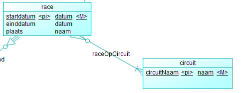

<h1 style="color:#d91e57;">Onderbouwing Oplevering</h1>

## Inleiding
Tijdens de presentatie van het prototype hebben wij een aantal feedback punten gekregen over het ontwerp van ons systeem.
De feedback die wij hebben gekregen staat in "Opdrachtgever Notule Prototype Oplevering.md". 
In dit document gaan we de feedback punten behandelen en onderbouwen waarom wij bepaalde keuzes hebben gemaakt.

## Aanpassingen
### CDM
De opdrachtgever heeft aangegeven dat er een relatie in het CDM niet helemaal klopte. Dat ging over de relatie tussen race en circuit. (Zie onderstaande afbeelding)

De relatie van race naar circuit is een race kan maar op een circuit tegelijk plaatsvinden. Het staat nu in het CDM alsof dat een race op meerdere circuits kan plaatsvinden.

Teams moeten in het CDM een entiteittype worden.

Het attribuut 'plaats' moet van race naar circuit worden verplaatst.

### PDM
Het PDM zal opnieuw gegenereerd moeten worden na de aanpassingen in het CDM.

### MSSQL
De MSSQL database zal opnieuw gegenereerd moeten worden na de aanpassingen in het PDM.
De Triggers moeten van de tabellen worden gehaald want daar mochten wij de data niet mee opsturen naar de API.
Een race uitslag teruggeven aan de API in plaats van alle race resultaten ooit.
Hierdoor word het systeem sneller.

Er moet een getimed proces worden gemaakt die alle data die is aangepast opstuurt.
Dit moet ongeveer om de minuut.

### FO
Het fully dressed usecase van het ophalen van de race uitslagen moet opnieuw worden geschreven. Dit komt doordat ons architecturele ontwerp is gewijzigd.

### TO
Non-functional requirements moeten worden uitgewerkt.

