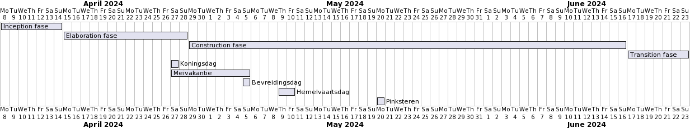

PVA

## 1. Inleiding
Voor het ISE-project gaan wij als projectgroep, A4, aan de slag met een opdracht voor de opdrachtgever ‘Jorg Janssen’.
De opdrachtgever is een docent van de Han die een relationele database wil waarin gegevens van Formule 1 races wordt verzameld. Deze relationele database gaat de data door sturen naar een staging area.(zie hoofdstuk 'Achtergrond van het project').

Dit document dient als het ware als een overeenkomst tussen de opdrachtgever (Jorg Janssen) en de projectgroep (A4) waarmee het doel van het project en het concrete resultaat vastgezet wordt.
Het document zal verder inzicht geven in de grenzen van het project, de kwaliteitseisen, de stappen die tijdens het project genomen worden om tot een goed resultaat te komen, de ontwikkelmethode en afspraken over het contact tussen alle partijen. 

## 2. Achtergrond van het project
Het project dat we gaan uitvoeren is een opdracht van Jorg Janssen, een docent aan de HAN. 
Het doel is om een API te ontwikkelen die toegang biedt tot een uitgebreide database met gegevens over Formule 1-races. 
Deze database zal veel informatie bevatten, variërend van coureurs en hun prestaties tot details over elke race. 

Deze API is bedoeld om te worden gebruikt door verschillende websites en platforms, waardoor ze gemakkelijk toegang hebben tot de gegevens die ze nodig hebben. Dit zal niet alleen de verspreiding van informatie over Formule 1-races vergemakkelijken, maar ook de ontwikkeling van nieuwe en innovatieve toepassingen mogelijk maken.

De opdrachtgever wil ook later een betalingssysteem toevoegen aan de API, zodat bedrijven die de API gebruiken een vergoeding moeten betalen voor het gebruik ervan.

## 3. Doelstelling, opdracht en op te leveren resultaten voor het bedrijf

In dit hoofdstuk zijn de doelstelling, opdracht en concrete, op te leveren resultaten beschreven.
### 3.1.  Doelstelling en opdracht

Het doel van de opdracht gever is een relationele database hebben die de gegevens door stuurt naar een staging area.
Tussen de 2 databases ligt ook een api systeem.
De klant kan dan via een API-systeem de data opvragen aan de staging area (dit API-systeem realiseren wij niet). 
Dit is dan gedaan zodat er minder stress op de database komt.
Het ultieme doel is om dit API-systeem tot het meest gebruikte en voorkeursplatform te maken voor het verkrijgen van Formule 1-gerelateerde informatie op alle websites.

De opdracht is een relationele database en een API op te leveren.
In deze database komt informatie over F1-coureurs en -races. 
Deze informatie kan worden opgehaald door middel van de API.
De API geeft dan de informatie in JSON-format terug aan de gebruiker.

Hiernaast leveren wij ook een Functioneel Ontwerp en een Technisch Ontwerp op.
Zodat wanneer wij klaar zijn met het project en het opgeleverd hebben. 
De volgende ontwikkelaars deze kunnen bekijken en weten waarom bepaalde keuzes zijn gemaakt.

### 3.2 Op te leveren resultaat

De projectgroep levert aan het einde van het project de volgende resultaten op:

- Systeem
  - MSSQL Database create scripts
  - MSSQL StoredProcedures
  - MSSQL Triggers
  - MSSQL T-SQL Testen
  - API-tussen de 2 databases
  - MongoDB non-relationele database
- Documentatie
  - PVA
  - Functioneel ontwerp (Dit document beschrijft de functionele vereisten en kenmerken van het applicatie.)
  - Technisch ontwerp (Dit document geeft een beschrijving van de architectuur, componenten, modules en technologieën die worden gebruikt om een applicatie te bouwen.)
  - Testrapport
  - Handleiding

## 4. Projectgrenzen
In dit hoofdstuk worden de grenzen van het project gesteld, met deze grenzen geeft het team aan wat zij niet gaan doen.
- Het project zal tussen de datums 08-04-2024 en 23-06-2024 plaatsvinden. Na 23-06-2024 word er niet meer aan het project gewerkt.
- Het team werkt van maandag tot en met vrijdag van 9:00 tot 17:00. Er wordt niet in het weekend en niet na 5 uur aan het project gewerkt.
- Het team zal voor dit project geen frontend werk verrichten. 
- Het team levert geen documentatie op in een andere taal dan Nederlands.
- Het team zal een relationele database gebruiken en geen andere soort database.
- Het team zal bugs die twee weken na de overdrachtsfase worden gevonden oplossen. Bugs die na deze twee weken worden gevonden zal het team niet meer oplossen.
- Het team zal een API opleveren die de gevraagde gegevens terug geeft.
- Het team zal een relationale Database opleveren.
- Het team zal een SQL create script opleveren waarmee een F1 database gemaakt kan worden.
- Het team zal een staging area opleveren.
- Het team zal het product niet deployen.
- Het team zal geen betalingssysteem voor de API key maken.

## 5. Randvoorwaarden
In dit hoofdstuk gaan we dieper in op de randvoorwaarden van het project.

### 5.1. Resources (B.v. soft- of hardware)
De opdrachtgever moet gedurende het project een Jira en Bitbucket omgeving beschikbaar stellen. Daarnaast moet er door de opdrachtgever voor alle groepsleden een webstorm licensie worden afgesloten die geldig is gedurende dit project. Wij maken gebruik van Jira voor het bijhouden van de sprintplanning, BitBucket voor versiebeheer van de code. Jira en BitBucket zijn tools van Atlassian, daardoor is er een goede integratie tussen deze tools. Door deze integratie kunnen wij vanuit Jira issues koppelen aan een branch in BitBucket.
Vanuit de opdrachtgever moet data beschikbaar gesteld worden in de vorm van een of meerdere `csv` bestanden. Deze data moet het team in de eerste week van het project krijgen. Met deze data kunnen wij de database opvullen en het systeem testen.

### 5.2. Verwachtingen van de opdrachtgever
Gedurende de gehele ontwikkelingsfase moet de opdrachtgever beschikbaar zijn voor de projectgroep voor communicatie. Het projectteam moet van maandag tot vrijdag elke dag antwoord kunnen geven op teams en mail berichten. De opdrachtgever speelt een cruciale rol in het geven van feedback en het nemen van beslissingen, wat noodzakelijk is voor een effectieve ontwikkeling.
We verwachten daarom ook dat we binnen 24 uur ook een mail terug krijgen van de opdrachtgever. Ook verwachten we minstens 1x per week elkaar fysiek te zien om de voortgang te bestpreken.

### 5.3. Locatie
De opdrachtgever moet locaties beschikbaar stellen zodat de projectgroep gezamenlijk op locatie kan werken aan het project tijdens de projecttijden. Deze locaties moeten op de HAN zijn.

## 6. Op te leveren producten en kwaliteitseisen
Alle document voldoen aan de AIM-controlekaart.

|  Product  | Product kwaliteitseisen (SMART)                                                                                                                                                                                                                                                                                                                                                                                                                                                                                                                                                                                                        | Benodigde activiteiten om tot het product te komen                                                                                                                                                                                                                                                                                                                                                                                                                                                                          | Proces kwaliteit 5xW 1xH                                                                                                                                                                                                                                                                                                                                                                                                                                                                                                                                                                                                              |
|:---------:|----------------------------------------------------------------------------------------------------------------------------------------------------------------------------------------------------------------------------------------------------------------------------------------------------------------------------------------------------------------------------------------------------------------------------------------------------------------------------------------------------------------------------------------------------------------------------------------------------------------------------------------|-----------------------------------------------------------------------------------------------------------------------------------------------------------------------------------------------------------------------------------------------------------------------------------------------------------------------------------------------------------------------------------------------------------------------------------------------------------------------------------------------------------------------------|---------------------------------------------------------------------------------------------------------------------------------------------------------------------------------------------------------------------------------------------------------------------------------------------------------------------------------------------------------------------------------------------------------------------------------------------------------------------------------------------------------------------------------------------------------------------------------------------------------------------------------------|
|    PvA    | Aan het einde van Week 1 (Zie hoofdstuk 9. Planning) geldt het volgende: Het Plan van Aanpak volgt de opbouw van het document ‘Toelichting op PvA 4.0’. In het Plan van Aanpak is overzichtelijk welke deelproducten opgeleverd zullen worden en is de aanleiding van het project beschreven. De eis voor ons van de opdrachtgever is dat de opdrachtgever het Plan van Aanpak heeft goedgekeurd.                                                                                                                                                                                                                                      | Er worden gesprekken gevoerd met de opdrachtgever om een helder beeld van de opdracht te krijgen. De hoofdstukken uit 'Toelichting plan van aanpak 4.0' worden verwerkt in het plan van aanpak.                                                                                                                                                                                                                                                                                                                             | Wanneer een onderdeel van het Plan van Aanpak wordt gerealiseerd, zal het onderdeel door twee mensen worden nagekeken volgens de definition of done en de eerdergenoemde productkwaliteitseisen, zodat dit van feedback kan worden voorzien. Zodra het PVA assesment is geweest gaat het projectteam de gekregen feedback verwerken.                                                                                                                                                                                                                                                                                                  |
|    FO     | Het FO moet volledig zijn. Het FO bevat een CDM waarin alle feittype zijn Geïmplementeerd. Alle dingen die de database moet kunnen doen zijn in een feittype geschreven. De gemaakte feittype kloppen syntactisch. Elke feit heeft minimaal 2 feittypes. Besluiten zijn onderbouwd en opgeschreven.                                                                                                                                                                                                                                                                                                                                    | We beginnen met het analyseren van de vereisten voor de databasefunctionaliteit. Dit vormt de basis voor de ontwikkeling van het Conceptueel Data Model (CDM).                                                                                                                                                                                                                                                                                                                                                              | Het ontwikkelteam creëert aan het begin van het project, in hun ontwikkelomgeving, een Functioneel Ontwerp (FO). Dit dient om de functionele vereisten en kenmerken van de applicatie te definiëren en te documenteren, wat helpt bij het ontwerpen en bouwen van de database. Dit FO wordt als een Markdown-bestand (.md) opgeslagen in de `/doc` map van het project. Door het analyseren van de vereisten, het ontwerpen van het Conceptueel Data Model (CDM) met geïmplementeerde feittypes, en het documenteren van deze in het FO.                                                                                              |
|    TO     | Het TO moet volledig zijn. De maatregelen die genomen zijn om de datakwaliteit te verbeteren, zijn gedocumenteerd met de bijbehorende code en de resultaten. Bevat een foto van het PDM. Het PDM komt overeen met het CDM. Besluiten tijdens het generen van het PDM zijn beschreven en onderbouwt. Alle tabellen en kolommen van de database zijn duidelijk beschreven. Alle business rules zijn beschreven. Alle Integrity rules en besluiten daarvan zijn beschreven en onderbouwt.                                                                                                                                                 | We moeten een PDM genereren die overeenkomt met het CDM uit het FO. Daarnaast moeten technische aspecten van het product uitgelegd worden.                                                                                                                                                                                                                                                                                                                                                                                  | Het ontwikkelteam creëert na het Functioneel Ontwerp (FO), in hun ontwikkelomgeving, een Technisch Ontwerp (TO). Dit dient om de technische implementatie van de databasefunctionaliteit te definiëren en te documenteren, wat helpt bij het bouwen van de database en de API. Dit TO wordt als een Markdown-bestand (.md) opgeslagen in de `/doc` map van het project. Door het genereren van een fysiek datamodel (PDM) dat overeenkomt met het Conceptueel Data Model (CDM) uit het FO, het documenteren van technische aspecten van het product, en het beschrijven en onderbouwen van besluiten tijdens het generen van het PDM. |
| API CODE  | De code moet 65% code coverage hebben. Voldoet aan de eisen over code uit de Definition of Done.                                                                                                                                                                                                                                                                                                                                                                                                                                                                                                                                       | De ontwikkeling van een API omvat een grondige analyse van de vereisten om te begrijpen wat de API moet bereiken, het ontwerpen van de endpoints en request/response structuren, het implementeren van de functionaliteiten met bijbehorende code, het uitvoeren van uitgebreide tests om de correcte werking te verifiëren, het opstellen van gedetailleerde documentatie voor gebruiksgemak, het waarborgen van veiligheid door implementatie van beveiligingsmaatregelen, het streven naar optimalisatie van prestaties. | Het ontwikkelteam, in hun ontwikkelomgeving, ontwikkelt tijdens de constructiefase van het project een API die toegang biedt tot de database met Formule 1-gegevens, om andere bedrijven in staat te stellen de gegevens te gebruiken voor hun eigen toepassingen, door het analyseren van de vereisten, het ontwerpen, implementeren, testen, documenteren, beveiligen, optimaliseren en onderhouden van de API.                                                                                                                                                                                                                     |
| SQL CODE  | De testcode moet specifieke functies van de software op een meetbare manier testen. Voldoet aan de eisen over code uit de Definition of Done. De database structuur moet overeenkomen met het CDM. De database structuur moet overeenkomen met het PDM.                                                                                                                                                                                                                                                                                                                                                                                | Het schrijven van unittest voor procedures, select statements, triggers en constraints.                                                                                                                                                                                                                                                                                                                                                                                                                                     | Het ontwikkelteam, in hun ontwikkelomgeving, ontwikkelt tijdens de constructiefase van het project SQL-code om de databasefunctionaliteit te implementeren die zijn gedefinieerd in het Technisch Ontwerp (TO), om de database te creëren en te manipuleren, en om de gegevens te beheren die door de API worden gebruikt, door het schrijven, testen en optimaliseren van de SQL-code.                                                                                                                                                                                                                                               |
| Test Plan | Tijdens het project (Zie hoofdstuk 9. Planning) wordt het testplan bijgehouden, zodat gecontroleerd wordt of de use cases van het FO op een correcte wijze verwerkt zijn. In het testplan wordt genoteerd wat getest wordt, hoe dit getest wordt en welke middelen nodig zijn om het te testen. Daarbij wordt bij elke test genoteerd op welke use case dit betrekking heeft, om de traceerbaarheid te waarborgen. De tests zullen uitgevoerd worden door twee leden van de projectgroep die zelf de betreffende functionaliteit niet gemaakt hebben, dit zal gedaan worden door stapsgewijs de stappen van dit document te doorlopen. | Wanneer nieuwe code wordt geschreven, wordt het testplan aangevuld met de informatie die benoemd is in de productkwaliteitseisen.                                                                                                                                                                                                                                                                                                                                                                                           | Wanneer een pull request wordt aangemaakt, wordt de code hierin door de reviewers getest. Hierbij worden de testscenario’s uitgevoerd zoals deze beschreven zijn in het testplan. Dit wordt door zowel de auteur als de twee reviewers gedaan. De reviewers controleren of het testplan aan de definition of done en productkwaliteitseisen voldoet, zodat dit van feedback kan worden voorzien.                                                                                                                                                                                                                                      |

## 7. Ontwikkelmethoden
### 7.1. RUP fases
Tijdens dit project gaat worden gewerkt via de RUP-methode. RUP is een goede methode voor dit project aangezien wij veel risico's hebben die wij moeten afbakenen en dit is één van de kern punten van RUP
Rup bestaat uit 4 verschillende fases: Inception, Elaboration, Construction en Transition.

Het project begint in de <b>Inception  fase</b>. In deze fase is het de bedoeling dat het team een goed beeld krijgt van het project. 
Dat kan het team doen door de volgende vragen te beantwoorden:
- Zijn we het eens over de scope? (Vision)
- Is er op zijn minst één oplossing of oplossingsrichting bekend?
- Zijn we het eens over de wensen en eisen? (Use Case Model en Acceptatieplan)
- Hebben we de belangrijkste risico’s en afdoende tegenmaatregelen in beeld? (Risicolijst)
- Zijn we het erover eens dat de globale planning en kosteninschatting realistisch zijn? (Software Development Plan)
- Zijn we het eens over het te volgen proces en de tools waarmee we de oplossing realiseren?
  
Deze vragen komen van [RupOpMaat.nl](https://rupopmaat.nl/)

De volgende fase is de <b> Elaboration fase</b>. In deze fase wordt er een architectuur opgesteld en worden de requirements verder uitgewerkt.
Tijdens deze fase moet het team een gedetailleerd beeld hebben van de meest kritische requirements. Ook moet er in deze fase een ontwikkelomgeving worden opgezet, bij de ontwikkelomgeving moet het team een prototype van het project maken.

Na de Elaboration fase komt de <b>Construction fase</b>. In deze fase wordt het project daadwerkelijk gebouwd. Aan het eind van deze fase moet alle functionaliteit van het project af zijn.

De laatste fase is de <b>Transition fase</b>. In deze fase wordt het project overgedragen aan de opdrachtgever. In deze fase moet het team de documentatie van het project afmaken en het project overdragen aan de opdrachtgever. In deze fase moet het team ook de laatste bugs uit het project halen en een overdrachtsdocument maken voor de opdrachtgever.

### 7.2. Verantwoordelijkheid rollen
In dit project zijn de volgende rollen aanwezig: Tester, Software-architect, Usecase Ontwerper, Informatie-analist en programmeur. 
De rol Tester is in dit project verantwoordelijk voor het maken van testplannen en het testen van de code. De Tester is eindverantwoordelijk dat alles getest is volgens de afspraken. De Software-architect is verantwoordelijk voor het maken van en documenteren van belangrijke ontwerpkeuzes, met een nadruk op de architectuur en technische mogelijkheden.  De Usecase Ontwerper is verantwoordelijk voor het maken van fully-dressed usecases. Daarbij is het belangrijk dat de Usecase ontwerper zich houd aan de afspraken die zijn gemaakt met de opdrachtgever. Dit doet hij doormiddel van het kijken naar de lijst van de requirements. De Informatie-analist is verantwoordelijk voor het opstellen van de requirements. De Informatie-analist is er voor verantwoordelijk dat de requirements overeenkomen met de opdracht. De programmeur is verantwoordelijk voor het ontwikkelen en documenteren van het eindproduct.

### 7.3. Scrum artefacten
In dit project gaan wij naast RUP ook gebruik maken van bepaalde Scrum artefacten en ceremonies. 
Zoals bijvoorbeeld een dagelijks daily stand-up meeting waarmee we streven naar transparantie binnen het team, zodat iedereen op de hoogte is van elkaars bezigheden.
Een sprint review na een increment (een periode van twee weken) waarmee we ervoor zorgen dat we duidelijk hebben wat er goed ging in het increment,
wat er slecht ging in een increment en wat er beter kan in het volgende increment. 
Een retro spectief na elk increment waarmee wij streven naar een verbetering in het groepsprocces doormiddel van elkaar KOET en GEIN feedback te geven.
Een Jira bord waarmee wij streven naar een overzicht en een goede planning. 

## 8. Projectorganisatie en communicatie
Dit project wordt gemaakt door het team: ise-2324s2-a4 (De A4tjes).

### 8.1. Rollen
In dit project zijn de volgende rollen aanwezig: Tester, Software-architect, Usecase Ontwerper, Informatie-analist en programmeur.
Die rollen worden verdeeld over de groepsleden, op die manier is elk groepslid eindverantwoordelijk voor een deel van het project. De rol programmeur wordt door iedereen opgepakt.
Dat komt omdat wij dit project met 4 groepsleden doen. Wij hebben ervoor gekozen om de rol programmeur door iedereen te laten oppakken omdat dat een rol leek waar iedereen zich al veel mee bezig gaat houden.
De rollen worden op deze manier verdeeld:

| Naam   | Rol                |
|--------|--------------------|
| Jannis | Informatie Analist |
| Niels  | Tester             |
| Dylano | Usecase Ontwerper  |
| Simon  | Software Architect |

### 8.2. Dagelijkse afspraken
Iedere dag beginnen wij om 9:15 met een stand-up meeting. Hierin bespreken wij wat we de vorige dag hebben gedaan en wat we die dag gaan doen. 
Ook bespreken we eventuele problemen en hoe we die gaan oplossen. 
De stand-up meeting duurt maximaal 15 minuten.
Door de daily stand-up meeting blijven we op de hoogte van elkaars werkzaamheden en kunnen we elkaar helpen waar nodig.

### 8.3. Wekelijkse afspraken
Om te zorgen dat er een goede samenwerking kan plaatsvinden met de Opdrachtgever wordt er elke week een meeting geplant. In deze meeting wordt de voortgang van het project en de planning besproken. Tijdens de vergadering kan de opdrachtgever feedback geven die de projectgroep vervolgens kan toepassen in het product.

### 8.4. Communicatie
Tijdens dit project wordt er gecommuniceerd tussen de groep op whatsapp en teams. Het contact met de opdrachtgever en procesbegeleider wordt via teams en mail gedaan.

### Contact gegevens
| Naam                    | Student NR | Email                               | Telefoonnummer |
|-------------------------|------------|-------------------------------------|----------------|
| Dylano Hartgers         | 1659658    | DD.Hartgers@student.han.nl          | 06-18431663    |
| Jannis Geerts           | 2107484    | JA.Geerts@student.han.nl            | 06-13919645    |
| Niels Germeraad         | 1667523    | N.Germeraad@student.han.nl          | 06-27283056    |
| Simon Klein Heerenbrink | 2106834    | SBH.Kleinheerenbrink@student.han.nl | 06-48586023    |
| Jorg Janssen            | -          | Jorg.Janssen@han.nl                 | 06-55337353    |
| Chris Scholten          | -          | Chris.Scholten@han.nl               | 06-55364250    |
| Luuk Feijt              | -          | Luuk.feijt@han.nl                   | 06-19664060    |

## 9. Planning

### 9.1. Vakanties en feestdagen
Het is belangrijk om rekening te houden met de vakanties en feestdagen tijdens de projectperiode. Hieronder is een overzicht van de vakanties en feestdagen die plaatsvinden tijdens ons project:  
Koningsdag: 27-04-2024  
Meivakantie: 27-04-2024 tot 05-05-2024  
Bevrijdingsdag: 05-05-2024  
Hemelvaartsdag: 09-05-2024 tot 10-05-2024  
Pinksteren: 20-05-2024  

Deze data zijn afkomstig van de officiële HAN kalender. We zullen deze data in onze planning opnemen om ervoor te zorgen dat we onze doelen op tijd kunnen bereiken, ondanks deze vrije dagen. Het is belangrijk om te noteren dat er geen werk zal worden uitgevoerd op deze dagen. We zullen onze planning dienovereenkomstig aanpassen.

### 9.2. Gantt

## 10. Risico’s
In dit hoofdstuk worden de risico's van het project besproken. Risico's zijn gebeurtenissen die de voortgang van het project kunnen belemmeren. Het is belangrijk om deze risico's te identificeren en te beoordelen, zodat er maatregelen kunnen worden genomen om de impact van deze risico's te minimaliseren.

| Risico                                            | Kans   | Impact | Tegenmaatregel                                                      | Uitwijkstrategie                                                                     |
|---------------------------------------------------|--------|--------|---------------------------------------------------------------------|--------------------------------------------------------------------------------------|
| Technische problemen met de ontwikkelomgeving     | Medium | Hoog   | Regelmatige updates en onderhoud van de ontwikkelomgeving           | Overstappen naar een andere ontwikkelomgeving                                        |
| Onvoldoende kennis van de gebruikte technologieën | Hoog   | Hoog   | Training en studie van de benodigde technologieën                   | Inschakelen van een externe consultant of het gebruik van alternatieve technologieën |
| Ziekte van teamleden                              | Laag   | Medium | Zorg voor voldoende documentatie en kennisdeling binnen het team    | Herverdeling van taken onder overige teamleden                                       |
| Verandering in projectvereisten                   | Medium | Hoog   | Regelmatige communicatie met de opdrachtgever en flexibele planning | Her planning en herprioritering van taken                                            |
 
## 11. Literatuurlijst
Jaarrooster. (z.d.). https://www.han.nl/studeren/jaarrooster/  
RupOpMaat.nl. (z.d.). https://rupopmaat.nl/  
plantuml. (z.d.). https://plantuml.com/

