<div style="color:#d91e57; font-size: 50px; font-weight: bold;">Technisch Ontwerp</div>

# Inleiding
In dit document laten we zien hoe we de keuzes van het FO hebben toegepast in het project.

# non-functional requirements
<table>
<th>id</th><th>performance</th>
<tr><td>nf1</td><td>Het systeem moet 100000 aanvragen per minuut aankunnen.</td></tr>
<tr><td>nf2</td><td>Er moeten geen requests van buiten de relationele database op de relationele database komen</td></tr>
<tr><td>nf3</td><td>Nieuwe data moet elke 2 minuten door gestuurd worden naar de non-relationele database</td></tr>
</table>


## uitwerkingen non-functional requirements

Nf2 hebben we opgelost door er een staging area toe te passen. Dit zorgt ervoor dat klanten op de staging area dingen aanroepen. 
Dit helpt met de load op de relationele database. Daarom helpt dit met de performance.

Nf3 hebben we opgelost door serverjobs op de sql server te hebben. Deze job kijkt dan elke 2 minuten of er iets in de que staat wat door gestuurd moet worden.
Als hier dan iets in staat wordt dat door gestuurd naar de non-relationele database via een api-systeem.

# Architecture overview
Er worden 3 servers gebruikt om alles te kunnen laten runnen.
In de afbeelding hieronder ziet u ze staan.
De eerste server **mssql** is de relationele database waar alle data in opgeslagen is.
Als er nieuwe data toegevoegd wordt. Gebeurt dat op deze server.

De **API** wordt los gedraaid van de andere 2 servers.
Dit zorgt ervoor dat de data op de non-relationele databases up-to-date blijft van de main database.

De laatste server **MongoDB** dit is de non-relationele database waar de klanten hun data vandaan kunnen gaan halen.
Hier hebben we dan ook voor een Document Store Database omdat we allemaal JSON documents opslaan.

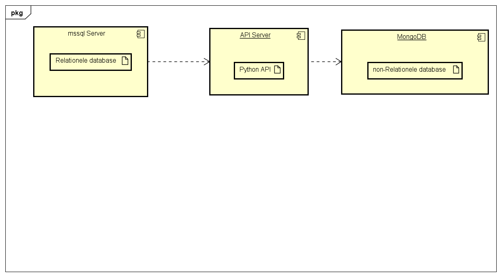

# PDM
Hieronder staat het PDM dat uit het CDM is gegenereerd.

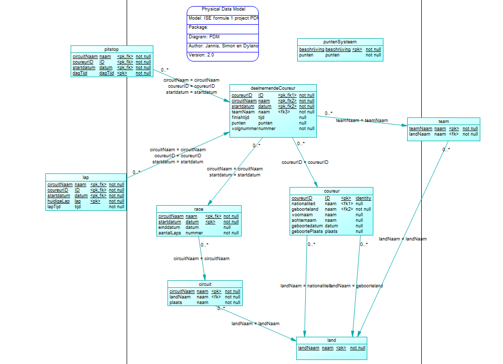

## tabellen
<table>
<th>Circuit</th>
<tr><td>circuitname</td><td>Naam van het circuit</td></tr>
<tr><td>landNaam</td><td>Naam van het land waar die inligt</td></tr>
<tr><td>plaats</td><td>Naam van de plaats waar het inligt</td></tr>
</table>

<table>
<th>Race</th>
<tr><td>circuitNaam</td><td>Naam van het circuit waar op geracet wordt</td></tr>
<tr><td>startdatum</td><td>Datum waar de race op start</td></tr>
<tr><td>einddatum</td><td>Datum van het einde van de race</td></tr>
<tr><td>aantalLaps</td><td>Hoeveel laps er gereden gaan worden op het circuit</td></tr>
</table>

<table>
<th>Land</th>
<tr><td>landNaam</td><td>Naam van het land</td></tr>
</table>

<table>
<th>puntenSysteem</th>
<tr><td>puntID</td><td>ID van punten</td></tr>
<tr><td>punten</td><td>Het aantal punten dat je krijgt</td></tr>
<tr><td>beschrijving</td><td>Beschrijving hoe je punten kan krijgen</td></tr>
</table>

<table>
<th>DeelnemendeCoureur</th>
<tr><td>coureurID</td><td>Het id van de coureur</td></tr>
<tr><td>circuitNaam</td><td>Naam van het circuit waar op geracet wordt</td></tr>
<tr><td>startDatum</td><td>Start datum van de race</td></tr>
<tr><td>teamNaam</td><td>Naam van het team</td></tr>
<tr><td>finishtijd</td><td>Hoelang er geracet is</td></tr>
<tr><td>punten</td><td>De punten die verdient zijn in de race</td></tr>
<tr><td>volgnummer</td><td>Welk nummer er op de auto staat van de coureur</td></tr>
</table>

<table>
<th>Coureur</th>
<tr><td>coureurID</td><td>Het id van de coureur</td></tr>
<tr><td>voornaam</td><td>Voornaam van de coureur</td></tr>
<tr><td>achternaam</td><td>Achternaam van de coureur</td></tr>
<tr><td>geboortedatum</td><td>De geboorte datum van de coureur</td></tr>
<tr><td>geboorteplaats</td><td>De plaats waar de coureur geboren is</td></tr>
<tr><td>nationaliteit</td><td>Het land waar de coureur voor uitkomt</td></tr>
<tr><td>geboorteland</td><td>Het land waar de coureur geboren is</td></tr>
</table>

<table>
<th>team</th>
<tr><td>teamNaam</td><td>Naam van het team</td></tr>
<tr><td>landNaam</td><td>Naam van het land waar het team uitkomt</td></tr>
</table>

<table>
<th>Lap</th>
<tr><td>circuitNaam</td><td>Naam van het circuit</td></tr>
<tr><td>coureurID</td><td>Id van de coureur</td></tr>
<tr><td>startdatum</td><td>Startdatum van de lap</td></tr>
<tr><td>huidigeLap</td><td>In welke ronde er gereden wordt</td></tr>
<tr><td>lapTijd</td><td>de tijd van de lap</td></tr>
</table>

<table>
<th>pitstop</th>
<tr><td>dagTijd</td><td>De tijd van de dag</td></tr>
<tr><td>circuitNaam</td><td>Naam van het circuit</td></tr>
<tr><td>coureurID</td><td>Id van de coureur</td></tr>
<tr><td>startdatum</td><td>Datum van pit</td></tr>
</table>

## Rules

### Integrity Rules 
R1: Trigger op tabel deelnemendeCoureur die checkt of er niet meer dan 20 coureurs zijn per Race op startdatum en circuit.<br>
R2: check-constraint op de tabel Race: startdatum < einddatum.<br>
R3: Trigger op tabel deelnemendeCoureur die check of volgnummer unique is per race.<br>
R4: <br>
R5: Trigger die checkt of de geboortedatum + 16 groter is dan startdatum.<br>
R6: Trigger die checkt of de <br>
### Besluiten Integrity Rules
**R1:**
We hebben voor deze rule gekozen omdat als er meer dan 20 coureurs in 1 race zijn er foutieve data in database komt te staan.
Door hier een stored procedure voor te maken voorkomen we dit.

**R2:**
We hebben voor deze rule gekozen om te voorkomen dat er foute data in de database komt te staan.

**R3:**
We hebben voor deze rule gekozen, omdat twee coureurs niet hetzelfde volgnummer mogen hebben per race.
We hebben niet voor de primary key volgnummer gekozen, omdat een coureurs volgnummer aangepast kan worden of vervallen waardoor je oude coureurs niet zou kunnen opslaan.
Daarnaast hebben wij voor een trigger gekozen, omdat het een te ingewikkelde business rule is voor een constraint en als je hem in de procedures neerzet als if statements zou je de code op allemaal verschillende plekken hebben staan.

**R4:**


**R5:**
We hebben voor deze rule gekozen, omdat een coureur ouder moet zijn dan 15 om mee te doen aan een race.
Dit is aangegeven door onze opdrachtgever.
Daarnaast hebben wij voor een trigger gekozen, omdat de rule twee verschillende tabellen nodig heeft en als je hem in de procedures neerzet als if statements zou je de code op allemaal verschillende plekken hebben staan.

**R6:**
## API Ontwerp
Om de verbinding tussen de mssql server en mongodb server te regelen wordt er een API ontworpen. 
Dit API-programma is geschreven in python en maakt gebruik van de library's Flask en pymongo. 
Van Flask worden de libraries Flask en request gebruikt.
Van pymongo wordt de MongoClient en ServerApi gebruikt.
De API luisterd naar POST verzoeken op de poort 4444.
De server luisterd naar het adres "http://localhost:4444".<br>
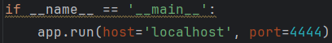

Wanneer de API een POST request ontvangt op de route "http://localhost:4444" wordt de functie receiveJson() aangeroepen.
Deze functie ontvangt de json data van de POST en haald daar de naam uit die in de mongodb word of gebruikt gaat worden.<br>
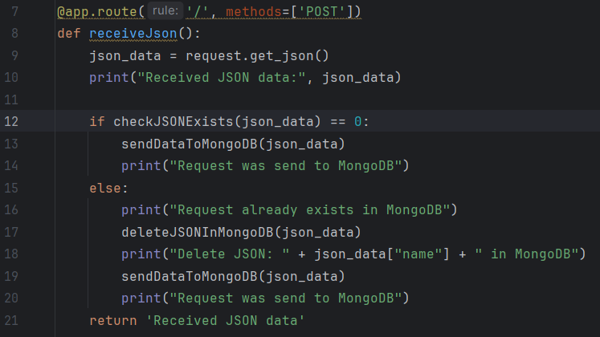

Het eerste IF-statement in die functie ziet er als volgt uit:<br>
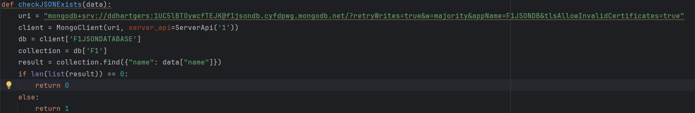

De functie checkJsonExists() kijkt of de naam al bestaat in de mongodb database.
Wanneer dit niet zo is kan de JSON die de API heeft ontvangen gelijk worden doorgestuurd naar MongoDB.
Het doorsturen van de Data doet hij met de functie sendDataToMongoDB().
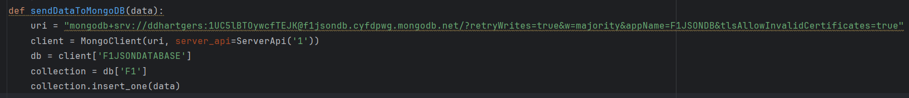

In de functie sendDataToMongoDB() maakt de API een verzoek door middel van een url met een connectie string naar de MongoDB server. 
Vervolgens wordt er een toevoegingsverzoek gestuurd met de nieuwe Json naar MongoDB.

Wanneer het systeem een naam tegenkomt die al bestaat in de MongoDB database dan wordt eerst de functie deleteJSONInMongoDB() uitgevoerd.
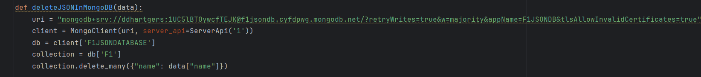

Deze functie verwijdert de data die al in mongodb staat met de naam die de API heeft ontvangen.
Vervolgens wordt de nieuwe data doorgestuurd naar MongoDB met de functie sendDataToMongoDB().
Op deze manier voorkomen we dat er dubbele JSON's in de mongodb database komen te staan.

## Getimed executie systeem
Voor het maken van het getimed executie systeem is het noodzakelijk dat er gebruik wordt gemaakt van de 'developer editie' van mssql
Om de versie van mssql te controleren kan de volgende query worden uitgevoerd:
```sql
SELECT SERVERPROPERTY('Edition');
SELECT IS_SRVROLEMEMBER ('sysadmin');
```
Uit 'SELECT SERVERPROPERTY('Edition');' moet 'Developer Edition' komen te staan en 'SELECT IS_SRVROLEMEMBER ('sysadmin');' moet '1' terug geven.
Als beide waar zijn kan de job manager worden gebruikt.
Om de data in MongoDB up-to-date te houden met de data in MSSQL is er een getimed executie systeem gemaakt. 
Voor dit systeem wordt er het 'job' systeem van mssql gebruikt.
Deze functie is alleen toegankelijk met de development editie van SQL Server management studio.
Dit systeem kan een of meerdere queries uitvoeren op een getimed interval. 
De data die in MongoDB staat mag maximaal 2 minuten achter lopen zijn.
De 'job' word daarom elke minuut uitgevoerd. Door de 'job' elke minuut uit tevoeren zorgen we ervoor dat de data in MongoDB altijd up-to-date is en dat het API-systeem een minuut de tijd heeft om de data te updaten.
De eis van de opdrachtgever was dat het maximaal 2 minuten achter mag lopen, wij hebben ervoor gekozen om het elke minuut te updaten zodat we meer speling hebben met de tijd. Dit proces zou nog vertraagd kunnen worden als dat later nodig blijkt te zijn.
Om ervoor te zorgen dat alle data maar een keer naar MongoDB gestuurd word, word er een tabel bij gehouden in MSSQL met de naam 'EXECUTION_SCHEMA'.
Deze tabel houdt het procedureID bij van het procedure dat moet worden uitgevoerd voor de update naar MongoDB.
Daarnaast onthoudt het schema bij of de stored procedure een parameter nodig heeft. In dit parameter veld kan een JSON gezet worden die door de job dynamisch vertaalt, wordt naar storedprocedure parameters.
De job haalt de data op uit de tabel en voert de stored procedure uit met de parameters die in de tabel staan.
Wanneer een storedprocedure executie slaagt, wordt de rij uit de tabel verwijderd, als hij faalt, wordt de rij niet verwijderd en wordt het veld 'EXECUTION_COUNT' met 1 verhoogd.
De job voert het proces met de laagste execution_count uit.
Dit zorgt ervoor dat het systeem alleen tijd kwijt is aan jobs die al een keer gefaald zijn als het systeem daar tijd voor heeft.
Zo wordt nieuwe data altijd eerst verwerkt en oude data als het systeem daar tijd voor heeft.
Een storedprocedure kan in combinatie met het parameter dat hij mee krijgt maar een keer in het executie-schema staan. Op deze manier wordt data niet twee keer in een job geupdated.

## Data laten opslaan of data updaten in MongoDB
Door middel van het getimed executie systeem kan data getimed worden verstuurd naar mongodb.
In het onderstaande plaatje is een weergave te zien van hoe dit systeem werkt:
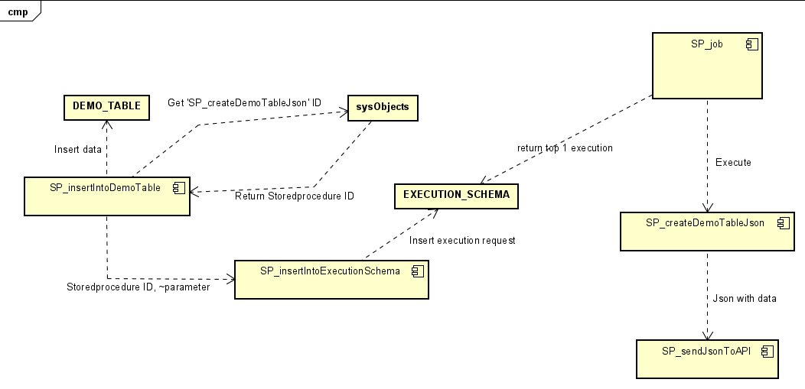 <br>

In het plaatje hierboven is te zien dat er twee processen parallel lopen. De job controlleerd of er een verzoek voor executie in de EXECUTION_SCHEMA tabel is gezet. Wanneer dit gedaan is doordat een storedprocedure een verzoek heeft ingedient door de storedprocedure 'SP_insertIntoExecutionSchema' uit te voeren zal de job deze executeren.
De storedprocedure die de job aanroept maakt de JSON die naar de API moet en verstuurd deze vervolgens naar de API met de storedprocedure 'SP_sendJsonToAPI'.

In het voorbeeld hieronder is te zien dat een de stored procedure 'SP_getRacePlanning' in het executie systeem wordt gezet voor executie. Daarna wordt de parameter JSON gegenereerd die nodig is voor de executie van 'SP_getRacePlanning'.
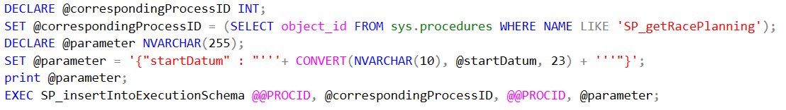 <br>

De SP_job kijkt of het 'correspondingProcessID' veld is ingevuld in het EXECUTIE_SCHEMA, wanneer dit het geval is voert de job het storedprocedure uit met dat id. Wanneer 'correspondingProcessID' niet is geset voort de job de storedprocedure uit met het eerste parameter veld van insertIntoExecutionSchema.

## Geschiedenis opslaan van database wijzigingen
Tijdens de levensduur van de database kan er data veranderen. 
Om toch terug te kunnen kijken hoe een situatie ooit was moet de geschiedenis van tabellen worden opgeslagen.
Door de oude rijen van een tabel op te slaan in een aparte tabel kan er altijd terug gekeken worden naar hoe de data er ooit uit zag.
Bij elke rij wordt bij gehouden van vanaf wanneer hij er in staat. Bij het geschiedenis tabel wordt bij gehouden tot wanneer de rij in de tabel stond.
Op deze manier is het afleidbaar wat er ooit in een tabel stond. Dit systeem moet worden toegepast op alle tabellen in de database.
MSSQL heeft een systeem waarmee dit automatisch te realiseren is: <a href="https://learn.microsoft.com/en-us/sql/relational-databases/tables/creating-a-system-versioned-temporal-table?view=sql-server-ver16">Microsoft SQL</a>. 
Omdat tijdens het ontwerp process de namen en aantal tabellen in de database kunnen wijzigen is er voor gekozen om een stored procedure te maken die dynamisch de namen van de tabellen omzet en daar de wijzigingen in aanbrengt.
Deze stored procedure wordt een keer aangeroepen tijdens het maken van de database. Wijzigingen daarna zullen handmatig moeten worden aangevuld op de manier die is beschreven in <a href="https://learn.microsoft.com/en-us/sql/relational-databases/tables/creating-a-system-versioned-temporal-table?view=sql-server-ver16">Microsoft SQL</a>.
Om de naam van de geschiedenis tabellen consistent te houden is er voor de format: "tabelnaam + '_History'" gekozen.
Doordat het aantal tabellen kan wijzigen moet er gebruik worden gemaakt van een while loop. Deze while loop moet itereren over elke tabel in de database en daarbij de volgende statements uitvoeren: <br>
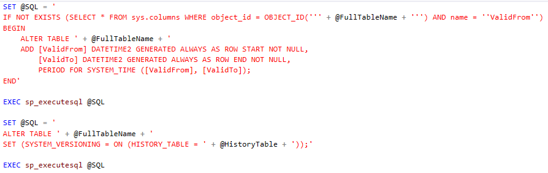 <br>
Deze statements voegen eerst de kollomen toe de datums bijhouden wanneer de rij in de tabel is gezet en tot wanneer hij geldig is.
Daarna zet het tweede statement het systeem aan voor de tabel. Dit zorgt ervoor dat de data in de geschiedenis tabel wordt bijgehouden.
De hele loop ziet er als volgt uit: <br>
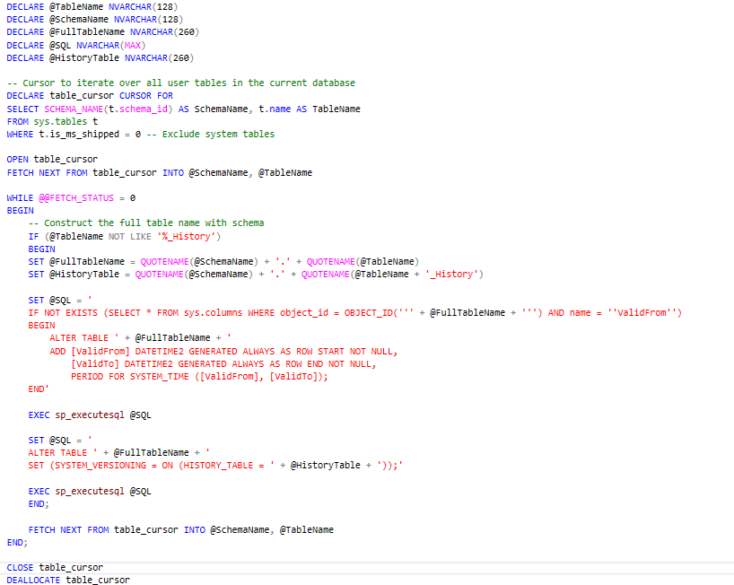 <br>
De while loop bekijkt of de naam die hij heeft ontvangen '_History' bevat. Dit doet hij zodat hij niet probeerd geschiedenis tabellen op geschiedenis tabellen te maken.
Als de tabelnaam niet eindigt op '_History' dan maakt hij de geschiedenis tabel aan.

## Indexen
Om de performance van querys op de database te verbeteren wordt er gekeken of het maken van indexen op tabellen de performance kan verbeteren.
Dit wordt gedaan door te kijken of er een scan veranderd kan worden in een seek.
Standaard staat er een index op de primary key van de tabellen.
Bij het testen van de indexen wordt nooit gekeken naar de validFrom en validTo kolommen, want die worden niet gebruikt in de querys die worden gebruikt.
Van de onderstaande querys wordt gekeken of er indexen gemaakt kunnen worden:
- SP_getRacePlanning

| StoredProcedure    | Betrokken tabel(en) | Getesten index(en)                                                                 | Beschrijving van resultaat                                                                                                                                                                                      |
|--------------------|---------------------|------------------------------------------------------------------------------------|-----------------------------------------------------------------------------------------------------------------------------------------------------------------------------------------------------------------|
| SP_getRacePlanning | RACE                | (RACE.CIRCUITNAAM), <br> (RACE.STARTDATUM), <br> (RACE.STARTDATUM, RACE.EINDDATUM) | Tijdens het testen van deze indexen is het niet gelukt om van de scan een seek te maken. Daarnaast was er geen meetbaar verschil tussen de verschillende indexen wanneer deze storedprocedure werd aangeroepen. |

## Realisatie functionaliteit
Tijdens het project hebben wij zoveel mogelijk functionaliteit geprobeerd te realiseren, maar door tijdsgebrek is dat helaas niet gelukt.
In dit hoofdstuk staat beschreven welke usecases wel en niet zijn gerealiseerd.

### Gerealiseerde functionaliteit
- Getimed executie systeem. <<Beschreven in het hoofdstuk 'Getimed executie systeem'>>
- API systeem. <<Beschreven in het hoofdstuk 'API ontwerp'>>
- Mongodb document database. <<Beschreven in file 'onderzoeken/OnderzoekStagingArea.pdf''>>
- Geschiedenis opslaan van database wijzigingen. <<Beschreven in het hoofdstuk 'Geschiedenis opslaan van database wijzigingen''>>
- Onderzoek naar indexen op de 'RACE' tabel. <<Beschreven in het hoofdstuk 'Indexen''>>
- Opslaan van race uitslagen in mongodb. <<SP_returnRaceResult>>
- Opslaan van race planning in mongodb. <<SP_updateRacePlanning>>
- Toevoegen van Circuit aan de database. <<SP_addCircuit>>
- Toevoegen van Land aan de database. <<SP_addCountry>>
- Toevoegen van team aan de database. <<SP_addTeam>>
- Toevoegen van coureur aan de database. <<SP_addCoureur>>
- Toevoegen van een Race planning aan de database. <<SP_addRacePlanning>>
- Toevoegen van een Race uitslag aan de database. <<SP_addRaceResult>>
- Verwijderen van een coureur uit de database. <<SP_deleteCoureur>>
- Verwijderen van data gekoppeld aan een coureur aan de database. <<SP_deleteCoureur>>
- Updaten van een coureur in de database. <<SP_updateCoureur>>
- Updaten van een ronde 'LAP'. <<SP_updateLap>>
- Updaten van een raceplanning. <<SP_updateRacePlanning>>
- De rol 'F1 beheerder'. <<rollen.sql>>
- De rol 'F1 Expert'. <<rollen.sql>>
- Er is een query geschreven die heel de database opbouwt. <<CreateF1Database.sql>>
- De verwoordingen die te maken hadden met de Usecases die zijn gerealiseerd zijn verwoord. <<Beschreven in bestand 'FO.md''>>
- Van de uitgewerkte verwoordingen is een CDM gemaakt. <<Beschreven in bestand 'analyseCasus/ISE fomule 1 project CDM.cdm''>>
- Van het CDM is een PDM gemaakt. <<Beschreven in bestand 'analyseCasus/ISE fomule 1 project pdm.pdm>>
- Er is een onderzoek geschreven waarin wordt onderzocht hoe het systeem sneller kan worden gemaakt. <<Beschreven in 'onderzoeken/OnderzoekenStagingArea.pdf''>>

### Niet gerealiseerde functionaliteit
- Toevoegen van kwalificatie uitslag.
- Verwijderen van een Circuit.
- Verwijderen van een Land.
- Verwijderen van een team.
- Updaten van een Circuit.
- Updaten van een Land.
- Updaten van een team.
- Opslaan van teams in mongodb.
- Opslaan van coureurs in mongodb.
- Opslaan van kwalificatie uitslagen in mongodb.
- Opslaan van circuits in mongodb.
- Opslaan van landen in mongodb.
- Gegevens verwijderen uit mongodb.

Hiernaast is er niks gerealiseerd om de data uit mongodb weer te geven.
Met de opdrachtgever is afgesproken dat wij JSONS klaar moeten zetten die andere mensen kunnen opvragen.

