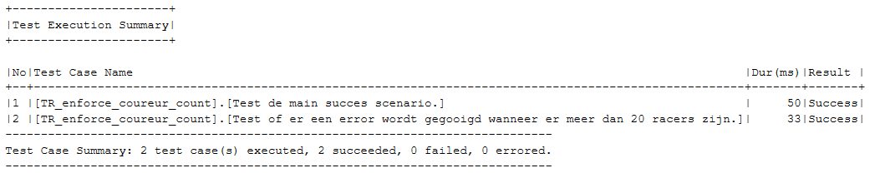
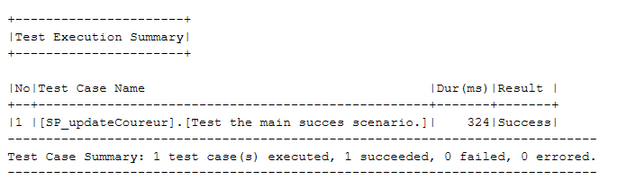

# Testplan

## Inleiding
Om de werking van het F1 systeem te waarborgen worden er tijdens het ontwerpen testen bedacht en uitgevoerd.
Door deze testen elke keer voor het inleveren van nieuwe code te runnen wordt de werking van de code gecontroleerd.
In het systeem worden alle storedprocedures getest. Dit word gedaan met gebruik van TSQLT.
Daarnaast worden ook de complexere constraints van het systeem getest, primary key en foreign key constraints worden niet getest.
Daar hebben wij voor gekozen omdat de werking van die constraints al door SQL Server zelf getest word.
TSQLT is een framework voor het testen van stored procedures in SQL Server.
Alle testen moeten voldoen aan een door ons opgestelde standaard en het DoD.
In het kopje "Testen schrijven" word onze standaard opgesomd.

## Testen schrijven
Bij het schrijven van testen moet er rekening gehouden worden met de volgende punten:
- Aan de naam van een test moet te zien zijn wat er getest word.
- Wanneer een nieuw systeem word test word er een nieuw unit test object aangemaakt onder alle oude unit test objecten in het unittest.sql bestand.
- Testen moeten single line getest worden.
- Testen moeten multi line getest worden.
- Wanneer een test data moet gebruiken moet deze altijd gemocked worden. De echte database mag niet gebruikt worden.
- Een test mag geen interacties hebben met de F1database.

## Testen uitvoeren
Nadat een test is geschreven moet deze worden getest of die slaagt voordat de code wordt gepushed.
Ook eerder gemaakte testen mogen niet falen.

## Test overzicht
Dit hoofdstuk bevat alle storedprocedures en of die worden getest.
<table>
<tr><td>Storedprocedure / Constraint / Trigger</td><td>Word getest</td></tr>
<tr><td>TR_enforce_coureur_count</td>         <td>X</td></tr>
<tr><td>SP_addCircuit</td>                                <td>X</td></tr>
<tr><td>SP_addCountry</td>                              <td>X</td></tr>
<tr><td>SP_addTeam</td>                                  <td>X</td></tr>
<tr><td>SP_addCoureur</td>                             <td>X</td></tr>
<tr><td>SP_addDeelnemendeCoureur</td>   <td></td></tr>
<tr><td>SP_addLap</td>                                     <td>X</td></tr>
<tr><td>SP_addRacePlanning</td>                   <td>X</td></tr>
<tr><td>SP_generateHistoryTables</td>         <td></td></tr>
<tr><td>SP_getRacePlanning</td>                    <td></td></tr>
<tr><td>SP_insertIntoExecutionSchema</td> <td></td></tr>
<tr><td>SP_returnRaceResult</td>                   <td></td></tr>
<tr><td>SP_sendJsonToAPI</td>                        <td></td></tr>
<tr><td>SP_updateCoureur</td>                        <td>X</td></tr>
<tr><td>SP_updateDeelnemendeCoureur</td><td>X</td></tr>
<tr><td>SP_updateLap</td>                                <td>X</td></tr>
<tr><td>SP_updateRacePlanning</td>             <td>X</td></tr>
<tr><td>SP_returnRaceResult</td>                   <td></td></tr>
<tr><td>SP_job</td>                                              <td></td></tr>
<tr><td>SP_deleteThisCoureur</td>                  <td></td></tr>
<tr><td>SP_deleteThisDeelnemendeCoureur</td> <td></td></tr>
<tr><td>SP_deleteLapForThisCoureur</td>   <td></td></tr>
<tr><td>SP_deletePitStopsForThisCoureur</td><td></td></tr>
</table>

## Test resultaten
#### TR_enforce_coureur_count

#### SP_addCircuit

#### SP_addCountry

#### SP_addTeam

#### SP_addCoureur

#### SP_addLap

#### SP_addRacePlanning

#### SP_updateCoureur
 

#### SP_updateDeelnemendeCoureur
 

#### SP_updateLap

#### SP_updateRacePlanning

