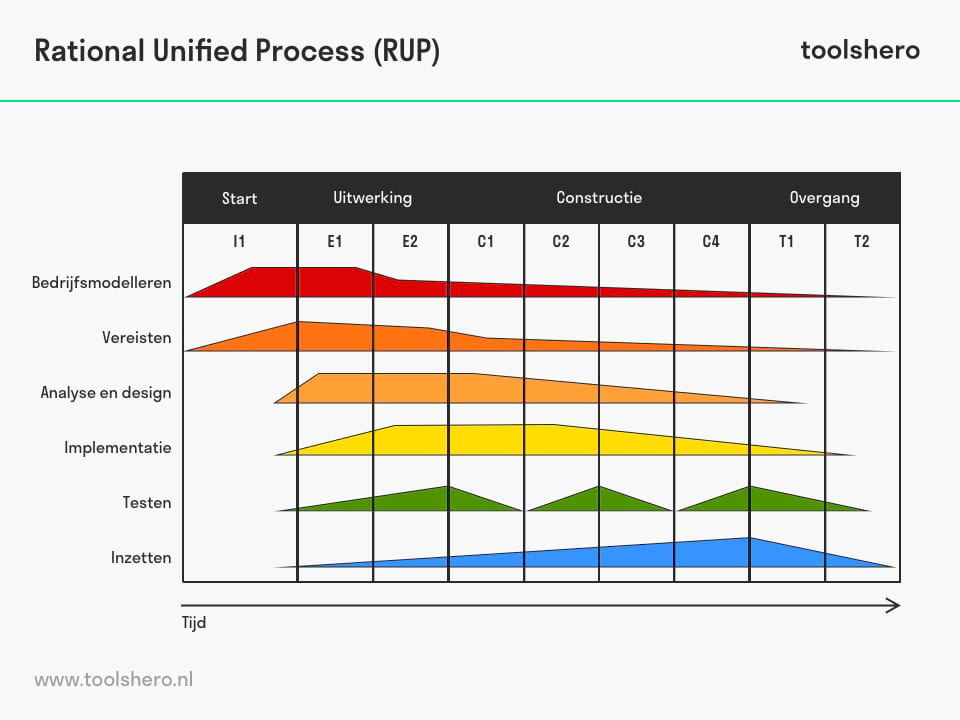

## RUP:
in 10 jaar nog nooit goed toegepast zien worden
Er is moet 1 rup er is een gedachtewereld achter rup

Incrementeel en iteratief

Dakpanbenadering

Risico mitigatie

Leidt tot fase denken

Doet "lineair" aan

-----------------------------------------------------------> 
Inception | Elaberation | Construction | Transition

Rup noemt het fase maar niet Lineair werken

Opdracht gever zo snel mogelijk iets van waarde leveren (informatie(Feiten voor definiëren))

Informatiemodel maken 

Informatiemodel gebruiken om json document op te baseren

Iets van waarden leveren is veel kleiner dan 100% leveeren

In E1 Informatie model maken zodat je risico uitsluit en kan aantonen wij json kunnen maken

Advies: 
- Probeer te komen tot vast stellen wat og blij zou maken
- Wat hij zou kunnen zien volgende week in een prototype

Informatie model 1/2 usecases

Graag zien dat in incrementen te zien valt wat je doet

Inhoud gaat steeds meer technisch worden

Inhoud gaat steeds minden business worden

Als je proces ingaat met og, bespreek wat plan is en wat oplevert wat vind u er van. Wat vind u er goed aan wat is er fout. Meenemen naar volgende increment
Wat wilt u in volgende increment zien

Iedereen vliegt altijd in patroon eerst informatie model dus niet goed RUP(lineair) toegepast

Rup zegt in elk increment moet alles op de agenda kunnen staan

Probeer je OG zover te krijgen dat jullie dit na streven dat eerst architectele prototype

Begin met een "lul" modelletje, en dan vragen aan OG wat hij interessant vind

Liever aan eind Kwaliteit dan kwantiteit
