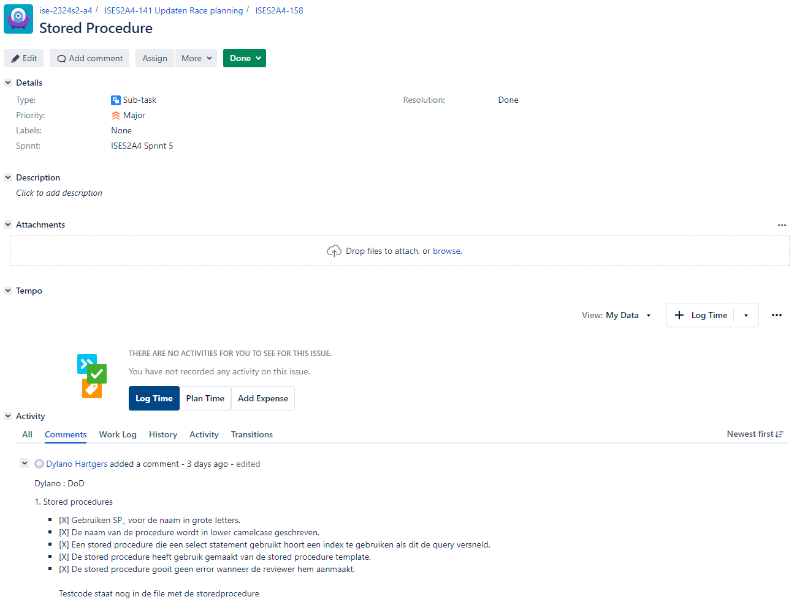
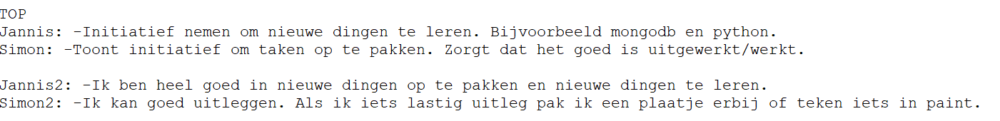

Persoonlijk verslag van Dylano Hartgers

# Inleiding
Het project waar ik nu aan mee doe, is het ISE-project. Wij hebben met onze groep de formule 1 casus uit gekozen.
Het groepje waarmee ik werk bestaat uit: Jannis Geerts, Simon Klein heerenbrink, Niels Germeraad en ikzelf.
De code van ons groepje is: ise-2324s2-a4.
Naast ons groepje hebben wij als procesbegeleider Chris Scholten, als opdrachtgever Jorg Janssen en als professionalskills begeleider Luuk Feijt.

De bedoeling van deze opdracht is een systeem te bouwen dat snel data beschikbaar kan stellen in JSON-format.
Die JSON's kunnen door klanten worden gebruikt om bijvoorbeeld race uitslagen weer te geven op hun websites.
Tijdens het ISE-semester heb ik geleerd hoe ik een relationele database kan ontwerpen door middel van verwoordingen en ontwerp principes.

Voor dit project heb ik een document gekregen met daarin voorbeeld data en de uitleg over de casus. Van dit voorbeeld data moet ik verwoordingen schrijven waaruit ik uiteindelijk een CDM kan afleiden.
Die verwoordingen worden met de opdrachtgever besproken zodat ik zeker weet dat ik het domein goed heb begrepen.

Het is de bedoeling dat wij dit project met een methode gaan werken die lijkt op scrum. De methode die wij gaan gebruiken heet RUP.
Ik heb zelf nog geen goed beeld van wat RUP precies inhoudt en vind het daardoor lastig om te bepalen waar in ons groep de prioriteiten moeten liggen tijdens het plannen van een fase.
Net als bij SCRUM wordt het proces opgedeeld in iteraties. Hierdoor komen we sneller problemen tegen en betrekken we de opdrachtgever meer bij het proces.
Wij hebben met onze procesbegeleider afgesproken om een vergadering te plannen in waarin RUP nog een keer duidelijk wordt uitgelegd.

# Kwaliteitsoordeel deelproducten
Aan het begin van dit project hebben wij als tip gekregen om de definition of done (DOD) zo te schrijven dat wij hem kunnen gebruiken als 'stappenplan' voor het nakijken van de deelproducten.
Hieronder staat een tabel met de feedback op de deelproducten waar wij aan hebben gewerkt. In die tabel zal een kwaliteitsoordeel staan.

| Onderdeel                                    | Oordeel over de kwaliteit                                                                                                                                                                                                                                                                                                                                                                                                                                                                                                                                                |
|----------------------------------------------|--------------------------------------------------------------------------------------------------------------------------------------------------------------------------------------------------------------------------------------------------------------------------------------------------------------------------------------------------------------------------------------------------------------------------------------------------------------------------------------------------------------------------------------------------------------------------|
| PvA (Plan van aanpak)                        | In het DoD staat beschreven welke punten belangrijk zijn voor de kwaliteit van het DoD. Die punten hebben wij nagelopen en die staan er allemaal in. De kwaliteit van ons PvA is goed.                                                                                                                                                                                                                                                                                                                                                                                   |       
| FO  (Functioneel ontwerp)                    | Doordat wij werken met de RUP methode word er elke iteratie opnieuw ontleed en ontworpen. Hierdoor is het FO pas af aan het eind van het project. Voor het FO hebben wij in het DoD ook eisen opgesteld. Deze hebben wij nog niet nagelopen dus het kan zijn dat er dingen ontbreken. Dit komt ook omdat wij vlak voor de tussentijdse oplevering nog aanpassingen aan het maken zijn aan de verwoordingen en CDM.                                                                                                                                                       |
| TO  (Technisch ontwerp)                      | De inhoud van het TO klopt al wel maar net zoals beschreven in het FO worden er tot het eind van het project dingen aangepast. Hierdoor kan het zijn dat het TO nog niet aan onze DoD voldoet.                                                                                                                                                                                                                                                                                                                                                                           |
| API                                          | Doordat wij drie dagen voor de tussentijdse oplevering hoorde dat ons architectureel plan niet klopte, hebben wij door tijdsgebrek nog geen mooie code kunnen schrijven. Het was nu de bedoeling om aan onze opdrachtgever een prototype aan te leveren dat bewijst dat de plekken waar in dit project risico's liggen (De document database en de verbinding tussen de databases). De code werkt wel maar is niet geschreven volgens de richtlijnen in het DoD. De kwaliteit is hierdoor slecht.                                                                        |
| Relationele database                         | Voor het ontwerpen van de relationele database hebben wij verwoordingen gemaakt en daarmee een CDM ontworpen. Beide het CDM en de verwoordingen hebben wij met de opdrachtgever besproken en die heeft ze goedgekeurd. Het script waarmee de database word gemaakt hebben wij uit een PDM laten genereren. Dit zorgt voorkomt syntax errors. De scripts die wij hebben opgeleverd voldoen nog niet aan het DoD, dit komt door het tijdsgebrek voor de tussentijdse oplevering. De kwaliteit is daarentegen wel hoog omdat alleen de scripts nog nagelopen moeten worden. |
| Non-relationele database (Document database) | Het document database gaan wij bespreken een docent. Met dat gesprek willen wij zien of dit voldoende is of niet. Wij hebben nog niets ontworpen voor die database, hij is zo simpel dat dat misschien niet hoeft. Dat willen we na dat gesprek bepalen. De kwaliteit van dit deelproduct is daardoor nog onbekend.                                                                                                                                                                                                                                                      |

# Kwaliteitsoordeel eindproduct
Voor het eindproduct hebben wij de volgende producten opgeleverd: API, Relationele database, Non-relationele database, Functioneel ontwerp en Technisch ontwerp.
Tijdens het maken van de producten heb ik voor het inleveren van een stuk de DoD erbij gepakt om de kwaliteit van het product veilig te stellen. In het plaatje is te zien hoe ik dat heb gedaan:  
  
Ik heb het kopje 'stored procedures' uit het DoD gekopieerd en vervolgens hier nagelopen voordat ik het product goedkeurde. 

# Evaluatie projectmethode
De RUP-methode bestaat uit vier fases. Elke fase heeft zijn eigen doel en prioriteiten.
Deze fases heeft Chris Scholten aan ons uitgelegd in een vergadering. <a href="../notulens/Notule 2e Gesprek Begeleider(16-04-2024).md">Notule vergadering RUP</a>. Wij hebben geprobeerd zoveel mogelijk volgens de RUP-methode te werken, maar helaas hadden de opdrachtgever en de procesbegeleider een andere visie op hoe wij moesten werken. Hierdoor was het voor ons lastig om te bepalen wat de prioriteiten waren. Doordat de visies van de opdrachtgever en de procesbegeleider niet overeen kwamen, hebben wij voorbereid wat de opdrachtgever niet van ons verwachten. Door al deze misverstanden onstond er een spanning tussen de groep en de opdrachtgever. Wij hebben de professional skills begeleider benaderd hoe wij dit conflict het best kunnen oplossen. In de tussentijd ging er allemaal tijd overheen. Wij hebben er met de groep voor gekozen om de tijd die wij hadden toch te benutten, in plaats van stil zitten zijn wij vooruit gaan werken. Hierdoor leek onze werkwijze op de waterval methode, dat was het enige alternatief naast niks doen.

Wij hebben in de tussentijd meerdere vergaderingen met de opdrachtgever gehad en zijn er nu over eens wat wij moeten gaan opleveren en hoe hij wil dat ons werkproces gaat. Wij doen tijdens een RUP Iteratie een stuk ontwerpen en een stuk maken. Wij passen hierbij constant de verwoordingen, CDM, PDM, TO en FO aan. Wij hebben op deze manier geprobeerd een prototype te maken waarmee we de risico's van dit project afdekken, helaas kwam dat niet helemaal goed uit met de deadline, want wij vonden nog dingen waarmee het prototype beter kon. Zo gaf de opdrachtgever bijvoorbeeld aan dat een relatie tussen race en circuit beter kon <a href="../notulens/?">Notule moet nog worden opgeleverd</a>.

Vlak voor de deadline van het prototype is Niels Germeraad helaas uitgevallen in verband met een burnout. Doordat wij nu met een man minder aan het werk moeten hebben wij met de opdracht gever afgesproken om ons op de kwaliteit te focussen van het product. Wij hoeven uiteindelijk minder functionaliteit op te leveren.

Tijdens het project heb ik ervaren dat de fases van RUP terug komen in het werk process. De ontwerpen die wij maken hebben wij bij elk UserStory opnieuw moeten uitbreiden of aanpassen om nieuwe functionaliteit toe te voegen. 
Doordat alle ontwerpen nooit echt af zijn is het vervelend dat ik soms dezelfde ontwerpen meerdere malen opnieuw moet maken.
De prioriteiten van de vier fases was wel heel duidelijk te merken. Dit ervaarde ik helaas later omdat onze elaboratie fase uit was gelopen.

# Mijn rollen in het project
In dit project moesten wij als groep de rollen: Programmeur, Informatie analyst, Software architect, Tester en Usecase ontwerper verdelen.
Doordat ik in het verleden veel moeite heb gehad met de vakken OOAD en FAT, heb ik ervoor gekozen om tijdens dit project als Usecase ontwerper te functioneren. 
Met deze rol wou ik mijn vaardigheden op het gebied van OOAD en FAT verbeteren.
In het begin van het project hebben wij met de groep een usecase diagram opgesteld, deze hebben wij vervolgens voorgelegd aan de opdrachtgever.
Tijdens de iteraties hebben wij met de opdracht gever overlegt welke userstorys wij moesten maken. Wanneer ik begon aan een usestory maakte ik eerst een fully dressed usecase.
Daarmee wil ik een helder beeld maken van wat er in de story moet gebeuren.

Daarnaast hebben wij de rol 'Programmeur' allemaal op ons genomen. Daar hebben wij voor gekozen omdat wij allemaal moeten programmeren om aan de factsheet te voldoen.
Drie weken in het project stopte Niels met het project in verband met een burnout. Hierdoor kwam de rol 'Tester' ook op de schouders van elk groepsgenoot te liggen.
Niet veel daarna vielen de rollen uit elkaar en deed iedereen alles. Wij maakte onze eigen usecases en programmeerde onze eigen code.
Aan het begin van het project was er tussen de groep en de opdrachtgever onenigheid over hoe en wat wij als groep moesten gaan doen. Wij kregen van de opdrachtgever en de procesbegeleider verschillende aanwijzingen. 
De opdrachtgever in dit project is ook een docent en omdat hij ons wou helpen met het project, gaf hij ons soms als opdrachtgever aanwijzingen die wij interpreteerde als een aanwijzing van een docent. Die aanwijzing hadden wij dus eigelijk moeten nergeren.
Door de verwarring in het begin heb ik er voor gekozen om aan de groep voor te stellen om alvast zoveel mogelijk verwoordingen uit te werken die wij uit de bijlages konden halen.
Dan zouden wij niet volgens de RUP-methode werken, maar dat leek mij beter dan stil zitten. Jannis en ik hebben ons toen gefocussed om de verwoordingen af te krijgen.
Later kregen we ondanks onze inzet een schop na omdat wij niet volgens de RUP-methode hadden gewerkt. Op dat moment was het idee RUP nog onduidelijk vanwege de verschillende aanwijzingen die wij hadden gekregen.

## Conclussie van rollen in het project
Door de verwarring in het begin van het project en door de uitval van een teamgenoot heb ik tijdens dit project niet de rol kunnen vervullen die ik wou vervullen, maar heb me gefocussed op alle taken die er waren.

# Leerpunten voor de tweede helft van het project
Tijdens het project hebben wij voor het de tussentijdse beoordeling een IPV gesprek gehouden met de groep om elkaar feedback te geven.
Met dit gesprek willen wij elkaar aanscherpen om beter te werken. Als de feedback die wij aan elkaar geven goed en relevant is kunnen wij als wij aan onze tips werken ervoor zorgen dat wij een efficienter team worden.
Mijn feedback tijdens het eerste IPV-gesprek was:
- Ik raak aan het eind van de dag snel afgeleid, ik moet me meer proberen te focussen op het project wanneer wij nog op school zijn.
- Ik neem soms zoveel taken op me dat mijn teamgenoten regelmatig wachten op taken die ik nog niet helemaal af heb.

Ik heb me geprobeerd meer te focussen op het project door mijn telefoon uit hand bereik te leggen in mijn tas. Daarnaast heb ik ijn groepsgenoten aangesproken wanneer zij niet meer op het project aan het focussen waren.
Mijn redenatie was: Als ik hun motiveer, motiveer ik mijzelf ook.
Het tweede punt heb ik aangepakt door op JIRA elke keer maximaal 2 taken op mij te nemen. Doordat alle taken waar ik mee bezig was daar op stonden konden mijn teamgenoten direct zien waar ik mee bezig waren en omdat het er maar maximaal twee waren, waren er nog genoeg taken over die hun konden doen zonder op mij te hoeven wachten.

# Mijn rol in eerdere projecten
In het OOSE-project was mijn taak vooral 'programmeur'. Dit vond ik toen niet uitdagend genoeg op sociaal vlak. Deze rol had ik destijds gekregen omdat ik met twee groepsgenoten zat die het OOSE project herkanste. Zei hadden al het ISE project gehaald en daardoor veel meer ervaring opgedaan met: contact met de opdrachtgever, het schrijven van project verslagen, testen en code ontwerpen. 
Door mijn beperkte kennis op die vlakken was het voor mij en hun makkelijk om mij alleen maar te laten programmeren. 

Dit project daarintegen hadden wij allemaal even veel ervaring, daarom vond ik het belangrijk om mij te ontwikkelen op de vlakken waar ik in het OOSE project niet aan toe was gekomen.
Dit heb ik gedaan door meer testen te schrijven voor mijn code, de opdrachtgever benaderen en verslagen schrijven met templates ernaast.

# Toelichting van competenties
## Factsheet
In de tabel hieronder staat een factsheet waarin de competenties staan die ik moet behalen tijdens dit project. Daar zal staan hoe ik de competentie heb gehaald en hoe een bron als 'bewijs' wanneer dat nodig is.
<table>
    <theader>
        <tr>
            <th>
                Competentie
            </th>
            <th>
                Bijdrage
            </th>
            <th>
                Beschrijving eigen bijdragen
            </th>
        </tr>
    </theader>
        <tr>
            <td>
                <strong>ISEP-01.</strong> 
                Je richt op grond van de gekozen ontwikkelmethodiek een software ontwikkeltraject projectmatig in en voert het uit, kiest geschikte methoden en technieken en past deze toe.
                Je bewaakt de voortgang van het project en stelt de planning indien nodig bij.  
            </td>
            <td>
                (Teamlid Dylano Hartgers/images/BurndownChart.png),   (Teamlid Dylano Hartgers/images/JiraBoardWithAgenda.png),   <a href="http://www.rupopmaat.nl/">RUP op Maat</a>
            </td>
            <td>
                Tijdens dit project hebben wij een JIRA-board bij gehouden. Dit hebben wij gedaan om de iteraties van een RUP-project in te kunnen plannen. Door op dat bord de taken en planning bij te houden heb ik ervoor gezorgd dat wij een duidelijk beeld hebben van wat er nog moet gebeuren en hoeveel tijd dat ongeveer nog ging kosten.   
                In de burndown chart is te zien hoe onze progressie van taken verliep. Die gaf ons een indruk van tijd van wat er nog moest gebeuren.   
                Wij hebben dit project gewerkt volgens de RUP-methode.
            </td>
        </tr>
        <tr>
            <td>
                <strong>ISEP-02.</strong>
                Je maakt een analyse van de eisen en wensen voor een informatiesysteem en stelt op basis van deze analyse een dynamisch model en een statisch model (d.w.z. conceptueel datamodel inclusief business rules) op en documenteert deze in een functioneel ontwerp.
            </td>
            <td>
                <a href="analyseCasus/feittypens.md">feittypens.md</a> 
                <a href="../FO.md">FO.md</a> 
                <a href="../notulens/Notule 5e Gesprek Opdrachtgever">Notule 5e Gesprek Opdrachtgever.md</a>
             </td>
            <td>
                In het de map analyse casus staat het document <a href="analyseCasus/feittypens.md">feittypens.md</a>. Ik heb in dat bestand meerdere bijlagens geanalyseerd om daar vervolgens de feittypens bij te maken.   In het <a href="../FO.md">FO.md</a> bestand staat een architectureel ontwerp. Dit ontwerp heb ik op basis van eisen van de opdrachtgever en de casus gemaakt.
            </td>
        </tr>
        <tr>
            <td>
                <strong>ISEP-03.</strong>
                Je stelt een technisch ontwerp op voor het te ontwikkelen informatiesysteem dat consistent is met het functioneel ontwerp en motiveert de ontwerpbeslissingen in relatie tot met de requirements. 
            </td>
            <td>
                FO.md,   TO.md,   (doc/casus/Projectopdracht ISE - Formule.pdf),   (doc/analyseCasus/feittypens.md)
            </td>
            <td>
                Ik heb gewerkt in het FO en TO. Deze bestanden helpen om duidelijk te maken hoe en wat we maken. Ik heb hierbij de stukken over het API, Data updaten in mongodb, Geschiedenis opslag systeem en het getimed executie systeem geschreven. Daarnaast heb ik in feittypens.md de feittypens gemaakt die ik heb kunnen vinden uit de bijlagens van de casus.
            </td>
        </tr>
        <tr>
            <td>
            <strong>ISEP-04.</strong> 
            Je bewaakt continu de kwaliteit van het ontwerp en van het te ontwikkelen systeem. 
            </td>
            <td>
                (images/VoorbeeldVanKwaliteitVeiligstellen.png),   DoDAangepast.md,   (code/scripts/unittest.sql)
           </td>
            <td>
                Tijdens het maken van dit project was het belangrijk dat alles wat ik oplever van goede kwaliteit is. Wat die goede kwaliteit inhoud hebben wij beschreven in DoDAangepast.md. Wanneer iemand iets af had zetten diegene zijn taak in review. Degene die het nakeek, moest het stukje uit de DoDAangepast.md copieeren en in de comment zetten van de taak. Vervolgds moest hij afvinken wat er al was gedaan.    Om ervoor te zorgen dat onze code blijft werken als wij iets aanpassen is, zijn er unittesten geschreven.
            </td>
        </tr>
        <tr>
            <td>
            <strong>ISEP-05.</strong>
            Je implementeert in teamverband het informatiesysteem in overeenstemming met het ontwerp ervan, zorgt voor traceerbaarheid tussen ontwerp en implementatie en motiveert eventuele afwijkingen.
            </td>
            <td>
                (images/traseerbaarheidVanCodeNaaruserstoryAantekening.png),   (images/branches.png),   TO.md
           </td>
            <td>
                Om in de code die ik heb geschreven te kunnen zien waarom de code is gemaakt staat er een beschrijving bij en tot welke usecase de code betrekking heeft. Daarnaast heb ik gewerkt in branches gegenereerd uit de tasks/subtasks in JIRA.   
                In het TO staan lastige systemen van ons project gedocumenteerd. In het TO staan ook afwijkingen van analyses.
            </td>
        </tr>
        <tr>
            <td>
            <strong>ISEP-06.</strong>
                Je draagt bij aan het goed functioneren van het ontwikkelteam en ondersteunt de leden van het team bij hun taakuitoefening. 
            </td>
            <td>
                <a href="https://jira.aimsites.nl/browse/ISES2A4-87">Jira item van het onderzoek</a>,  
                (images/FeedbackIPV2.png),   (images/FeedbackGevenAanGroepsgenoten.png)
            </td>
            <td>
                Ik heb feedback gegeven op mijn groepsgenoten over het product waar hun mee aan het werk waren. Dit heb ik al meerdere keren gedaan maar een voorbeeld daarvan was wanneer Simon aan het werk was aan het OnderzoekStagingArea, daar had ik hem feedback gegeven over zijn Abstact van het verslag. Die feedback staat in de comment van het item.
            </td>
        </tr>
        <tr>
            <td>
            <strong>ISEP-07.</strong>
            Je verdiept je zelfstandig verder in de beroepstaak.
            </td>
            <td>
                (code/api/F1API.py),   (code/scripts/SP_generateHistoryTables.sql),   (onderzoeken/OnderzoekStagingArea.md)
            </td>
            <td>
                Tijdens de gesprekken met de opdrachtgever is gebleken dat het systeem gebruik moet maken van technieken die ik nog nooit heb gehoord. Ik heb me verdiept in het maken van: een 'job' in mssql, Het dynamisch maken van SQL executies, Python API en verbinding naar MongoDB.
                Ook heb ik me verdiept in de werking van geschiedenis tabellen.
            </td>
        </tr>
</table>

# Werken aan leerdoelen
## Leerdoelen
Om mijzelf te ontwikkelen heb ik aan het begin van het project twee leerdoelen opgesteld. Door aan deze leerdoelen te werken wil ik mij een waardevoller lid van het team maken.

### Leerdoel 1
Tijdens het OOSE project heb ik als feedback gekregen dat ik mijn code beter moet documenteren. Doordat ik wat ik in het OOSE project had gemaakt niet goed had beschreven, hadden mijn groepsgenoten veel moeite met het begrijpen van wat mijn code deed.
Dit effect werd versterkt omdat ik technieken moest onderzoeken die het team nog nooit eerder had gezien. Ik wil door mijn code beter te documeteren mijn teamgenoten helpen om mijn code beter te begrijpen.
Dit ga ik verbeteren door elke keer als ik stukken code of een systeem ontwerp een uitleg daarvan te maken in het technisch ontwerp.
Daarnaast ga ik ook mijn code beter documenteren door gebruik te maken van commentaar in de code. Ik wil dit hebben verbeterd voor de inlever datum van het ISE-project (05-06-2024).
Tijdens het project laat ik door mijn groepsgenoten feedback maken op mijn documentatie, daarnaast zal ik bij hun toetsen of zij mijn code of systemen goed hebben begrepen.
Bij mijn uitleg zal ik gebruik gaan maken van plaatjes en voorbeelden om mijn uitleg te verduidelijken.

### Leerdoel 2
Verder had ik als feedback gekregen in het OOSE en in het I-project dat ik mijn vergaderingen met de opdrachtgever beter moet voorbereiden. Ik heb die vergaderingen wel eens gedaan zonder voorbereiding en toen wisten wij niet wat er gevraagt of ge'demo'd worden.
Ik wil dit verbeteren door voor elke vergadering met de opdrachtgever een agenda te maken. In deze agenda wil ik de punten die besproken moeten worden opschrijven en daarbij ook de vragen die ik wil stellen.
Dit ga ik toetsen door vaker de rol als voorzitter op mij te nemen voor een vergadering. Op die manier wil ik mijzelf forseren om meer moeite in een vergadering te stoppen.
Ik wil dit hebben verbetert voor de inlever datum van het ISE-project (05-06-2024).
Dit ga ik toetsen door agendas te laten maken door mijn groepsgenoten en te of daar alle vragen die wij als groep hadden voor de vergadering beantwoord zijn.

## Voortgang leerdoelen
In dit kopje worden moment opnames gemaakt van de voortgang van de leerdoelen.

### Leerdoel 1
Doordat ik in het begin van het project nog bijna geen code had kunnen schrijven was het lastig om toen al alvast aan het leerdoel te werken. Nu het systeem wat wij ontwerpen steeds complexer word het ik meer om te documenten.
Ik heb een systeem bedacht en ontworpen om dynamisch SQL uit te laten voeren. Dit systeem had ik zelf bedacht, daardoor was het heel belangrijk dat de rest van de groep snapt hoe het werkt.
Voor het project moeten wij een technisch ontwerp maken. Daar staat in beschreven hoe wij het systeem gaan realiseren. Daar staat de documentatie van het systeem wat ik het gemaakt onder de kopjes 'Getimed executie systeem' en 'Data laten opslaan of data updaten in MongoDB'.
In deze kopjes is beschreven hoe het systeem werkt en wat het doet. Met behulp van plaatjes heb ik het systeem beter kunnen uitleggen.
Als TOP tijdens het tweede IPV-gesprek kreeg ik van een van mijn groepsgenoten dit te horen:  
  
Bij Simon2 is de feedback omtrend mijn uitleg te zien.

### Leerdoel 2
Tijdens dit project heb ik vergaderingen met de opdrachtgever voorbereid om ervoor te zorgen dat de vergaderingen soepeler verliepen. Ik heb voor elke vergadering een agenda gemaakt en daarbij ook de vragen die ik wilde stellen opgeschreven.
Een voorbeeld hiervan is het bestand (gesprekkenOG/AgendaFeedbackDoD(16-04-24).md). In dit bestand is de agenda met de vragen te zien die wij beantwoord wilde hebben na dit gesprek.
De notule die bij dit gesprek hoord is te vinden in het bestand (notulens/Notulen 2e gesprek opdrachtgever (16-04-2024).md). In dit bestand is te zien dat de vragen die ik had gesteld ook beantwoord zijn.

AgendaOpdrachtgever(23-04-2024) is nog een voorbeeld van een agenda die wij hebben voorbereid. Doordat er geen localen te reserveren waren hebben wij net voor de vergaderingen contact opgezocht met de opdrachtgever om hem ons locaal door te sturen.
Dit deden we op deze manier omdat het voor ons vaak nog onduidelijk was of wij in een locaal konden blijven zitten.

Ik had mij graag meer op dit leerdoel willen focussen, maar helaas is dat niet gelukt, omdat ik het idee had dat er dit project niks goed ging was de motivatie om dit soort dingen goed voor te bereiden verdwenen. Ik wilde mij liever focussen op het opleveren van het product van het project.

# Conclusie
Tijdens dit project heb ik mijn kennis van het analyseren van een casus en daar een functioneel ontwerp van maken kunnen verbeteren. Dit heb ik gedaan door de casus te analyseren en daar een FO van te maken.
Daarnaast heb ik me in dit project ook weer gefocussed op het gebruiken van voor ons nieuwe technieken. 
Ik heb met mijn leerdoelen mijn contact met de opdrachtgever en het documenteren van mijn code verbeterd.

Tijdens dit project heb ik ervaren waar de grens van mijn welzijn ligt. Ik heb zoveel stress van dit project gehad dat ik zoiets nooit meer wil ervaren.
Ik wil hier voor het ASD-project een leerdoel van maken.
De enige reden dat ik me tot het eind heb ingezet voor dit project is, omdat ik groepsgenoten heb die ik niet teleur wil stellen.
Ook moet ik me meer focussen op het persoonlijk verslag ook al neemt dit tijd in voor de realisatie van het project zelf.

# Bronnenlijst
- Remi-Armand Collaris en Eef Dekker, remi-armand.collaris@ordina.nl. (z.d.). RUP op maat. http://www.rupopmaat.nl/

